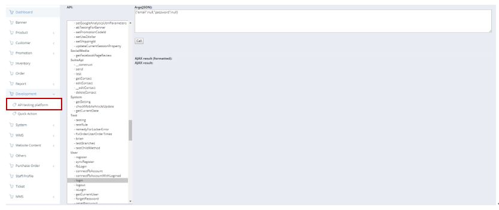

************
API Testing Platform Module 
************
The API Testing Module provides shortcut for IT Team Colleagues to perform certain instructions on the platform.

|api|

.. list-table:: API Testing Platform Module
    :widths: 10 50
    :header-rows: 1
    :stub-columns: 1

    * - FIELD NAME
      - FIELD DESCRIPTION
    * - API
      - Users can select different short cut functions in the API list
    * - Argds (JSON)
      - The shortcut arguments is displayed her for Users to edit and execute

