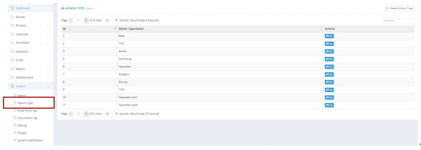
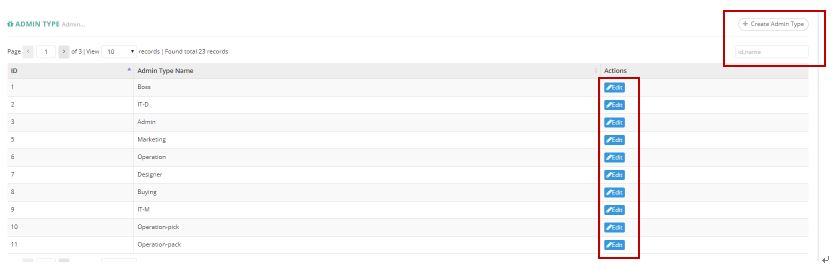
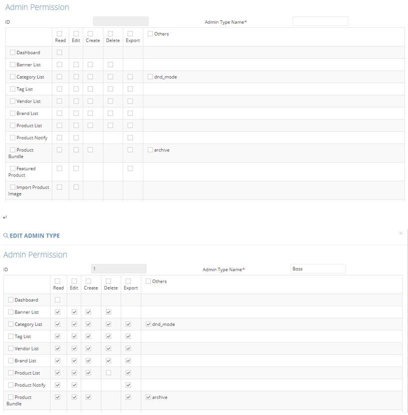

************
Admin Type Module 
************
Admin Type Module displays the details of different Admin Types. Users can Create and Search for Admin Types. You can also edit details of different Admin Types by clicking on the corresponding button in the “Actions” column.'

|admintype|

.. list-table:: Admin Type Module
    :widths: 10 50
    :header-rows: 1
    :stub-columns: 1

    * - FIELD NAME
      - FIELD DESCRIPTIONS
    * - ID
      - The Admin Type ID
    * - Admin Type Name
      - The Name of Admin Type
    * - Actions
      - Edit - Edit Admin Type Information
      
Buttons
==================
Users can Create new Admin Type by clicking on the button or Search Admin Type on top of Admin Type table. You can also click on the corresponding button in the “Actions” column to Edit the details of an Admin Type.

|admintype_buttons|

.. list-table:: Admin Type Module Buttons
    :widths: 10 50
    :header-rows: 1
    :stub-columns: 1

    * - BUTTONS
      - DESCRIPTIONS
    * - Create Admin Type
      - Users can Create new Admin Type by inputting New Admin Type Details into the popup window.
    * - ID, name Input Box
      - Users can easy search Admin Type by inputting the ID or Name into the Input Box
    * - Edit
      - Edit Admin Type Information
      
Create and Edit
==================
Users can Create New Admin Type by clicking on the “Create Admin Type” button on top of the Admin Type Table and input New Admin Type Details into the popup window.
User can also edit individual Admin Type Details by clicking on the “Edit” button in the “Action” column of the specific Admin Type.

|admintype_create|

.. list-table:: Admin Type Module Create and Edit
    :widths: 10 50
    :header-rows: 1
    :stub-columns: 1

    * - FIELD NAME
      - FIELD DESCRIPTIONS
    * - ID
      - The Admin Type ID
    * - Admin Type Name
      - The Name of Admin Type
    * - Admin Type Access Right
      - Select the Access Right of The Admin Type

