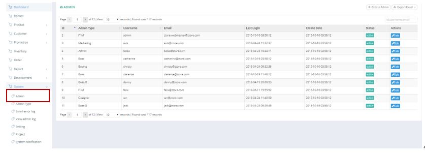
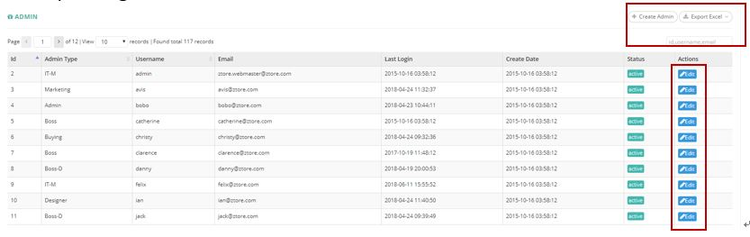
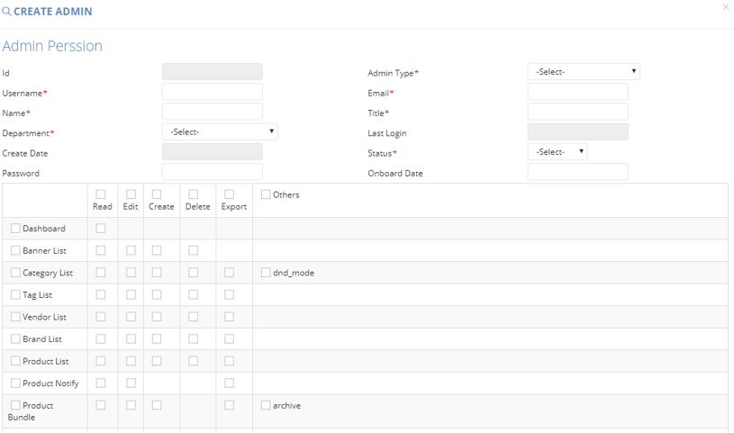
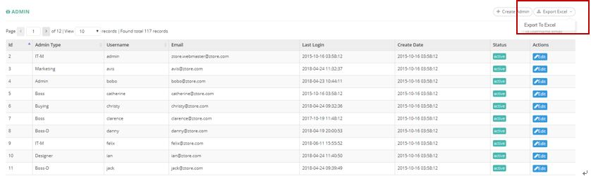

************
Admin Module 
************
Admin Module displays the Account Details of different Admins. Users can Create and Search Admin by clicking on the buttons on top of the Admin table. You can also Edit Admin Details by clicking on the corresponding buttons in the “Actions” column.

|admin|

.. list-table:: Admin Module
    :widths: 10 50
    :header-rows: 1
    :stub-columns: 1

    * - FIELD NAME
      - FIELD DESCRIPTION
    * - ID
      - The Admin ID
    * - Admin Type
      - The Type of Admin Access
    * - Username
      - The User Name for Admin Account
    * - Email
      - The Email for Admin Account
    * - Last Login
      - The Time of latest login of The Admin Account
    * - Create Date
      - The Time Creating The Admin Account
    * - Status
      - Active/ Inactive
    * - Action
      - Edit Admin\
      
Buttons
==================
Users can click on the buttons above the Admin Table to Create new Admin Accounts and Export Admin Account Details in Excel format. You can also click on the corresponding button to Edit Admin Account Details.

|admin_buttons|

.. list-table:: Admin Module Buttons
    :widths: 10 50
    :header-rows: 1
    :stub-columns: 1

    * - BUTTONS
      - DESCRIPTIONS
    * - Create Admin
      - Users can create new Admin Account by inputting Admin details into the popup window
    * - Export Excel
      - User can Admin account details in Excel Format
    * - Id, username, email Input Box
      - User can carry out easy search by inputting Admin details into the Input Box
      
Create
==================
Users can Create new Admin Account by clicking on the “Create Admin” button on top of the Admin Table and input the new Admin Account Details into the popup window.

|admin_create|

.. list-table:: Admin Module Create
    :widths: 10 50
    :header-rows: 1
    :stub-columns: 1

    * - FIELD NAME
      - FIELD DESCRIPTION
    * - ID
      - The Admin ID
    * - Admin Type
      - The Type of Admin Access
    * - Username
      - The User Name for Admin Account
    * - Email
      - The Email for Admin Account
    * - Name
      - The Name of Admin
    * - Title
      - The Title of Admin
    * - Department
      - The Department of Admin
    * - Last Login
      - The Latest Login Date of The Admin
    * - Create Date
      - The Date Creating the Admin Account
    * - Status
      - Active/ Inactive Admin
    * - Password
      - The Password of Admin Account
    * - Onboard Date
      - The Onboard Date of Admin
    * - Access Right Selection
      - Select the access right options for the Admin Account
      
Admin Report
==================
Users can export Admin Account Details in Excel Format by clicking on the “Export Excel” button on top of the Admin Table.

|admin_report|

.. list-table:: Admin Report
    :widths: 10 50
    :header-rows: 1
    :stub-columns: 1

    * - FIELD NAME
      - FIELD DESCRIPTION
    * - ID
      - The Admin ID
    * - ADMIN TYPE
      - The Admin Type
    * - USERNAME
      - The Admin Username
    * - EMAIL
      - The Admin Email 
    * - NAME
      - The Name of Admin
    * - POSITION
      - The Position of Admin
    * - TEAM
      - The Team of Admin
    * - LAST LOGIN
      - The Date of Last Login 
    * - CREATE DAY
      - The Admin Account Creating Day
    * - ACTIVE
      - Active/ Inactive Admin Account

