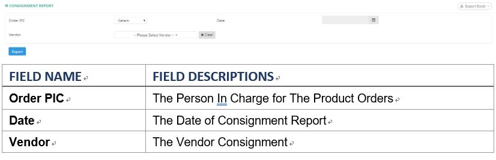
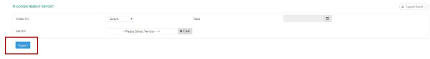

************
Consignment Report Module
************

|cons|

.. list-table:: Consignment Report Module
    :widths: 10 50
    :header-rows: 1
    :stub-columns: 1

    * - FIELD NAME
      - FIELD DESCRIPTIONS
    * - Order PIC
      - The Person In Charge for The Product Orders
    * - Date
      - The Date of Consignment Report
    * - Vendor
      - The Vendor Consignment
      
Consignment Report
==================
User can Extract the Consignment Details according to different Vendor specified in Excel Format by clicking the “Export” button.

|consreport|

.. list-table:: Consignment Report 
    :widths: 10 50
    :header-rows: 1
    :stub-columns: 1

    * - FIELD NAME
      - FIELD DESCRIPTIONS
    * - Product Code
      - The Product ID
    * - Barcode
      - The Product Barcode
    * - Vendor Item Code
      - The Vendor ID
    * - Chinese Brand Name
      - The Chinese Product Brand Name
    * - Chinese Product Description
      - The Chinese Product Description
    * - Packsize
      - The Units of Products in a single Pack
    * - RSP
      - Retail Sales Price
    * - Consignment Rate
      - 
    * - Remaining SOH - 2018-03-01 00:00:00
      - 
    * - Inbounded DN18022811500205
      - 
    * - Sales Value
      - The Product Sales Value
    * - Sales QTY
      - The Product Sales Quantity
    * - Cost
      - The Product Cost
    * - Sales Value (Clearance)
      - Sales amount for clearance batch
    * - Sales QTY (Clearance)
      - Product Quantity sold for clearance batch
    * - Cost
      - The Cost of Each Product Unit
    * - Total Sales
      - The total Sales of The Product
    * - Total Sales QTY
      - The Total Units Quantity Sales of The Product
    * - Total Cost
      - The Total Cost of Product Sales
    * - Bad Condition
      - 
    * - Remarks
      - The Additional Information of Consignment
    * - Adjustment
      - Number of inventory adjustment from excel upload (not from PO)
    * - Remaining SOH - 2018-03-31 23:59:59
      - 
    * - SOH on 2018-03-31 23:59:59
      - 
    * - Difference
      - Difference between above two fields

