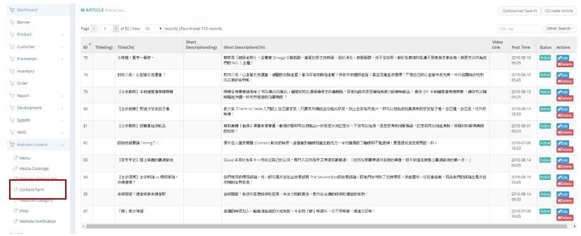
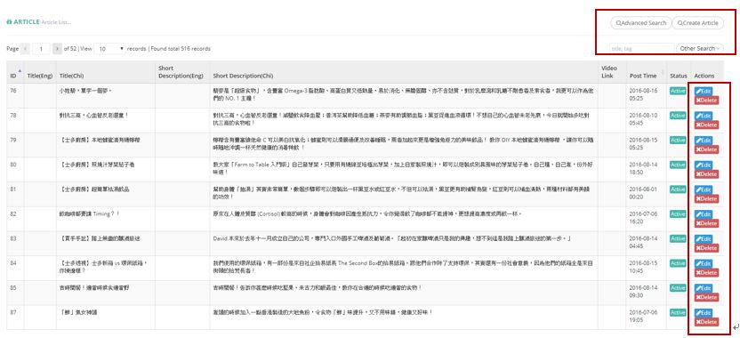
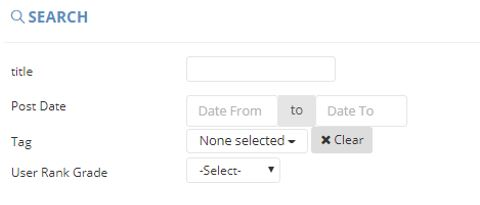
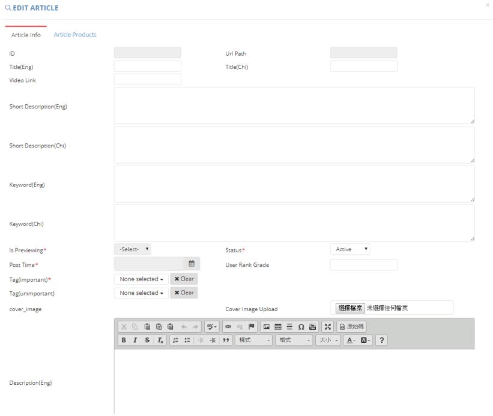
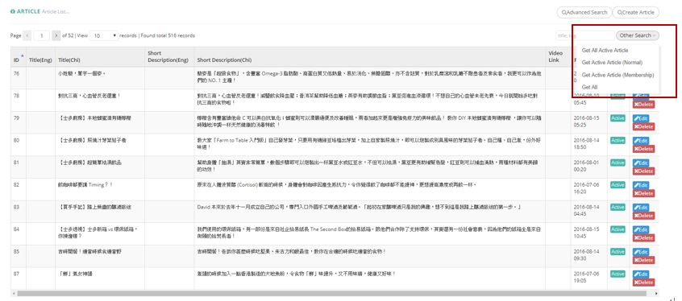

************
Content Farm Module
************
Content Farm Module displays the Article Content and Details founded on the Ztore Website. 

|contentfarm|

.. list-table:: Content Farm Module
    :widths: 10 50
    :header-rows: 1
    :stub-columns: 1

    * - FIELD NAME
      - FIELD DESCRIPTIONS
    * - ID
      - The Article ID
    * - Title(Eng)
      - The English Article Title
    * - Title(Chi)
      - The Chinese Article Title
    * - Short Description(Eng)
      - The Short Description of Content in English
    * - Short Description(Chi)
      - The Short Description of Content in Chinese
    * - Video Link
      - The Video Link of Content
    * - Post Time
      - The Posting Time of Content
    * - Status
      - Active/ Inactive Article
    * - Actions
      - Edit/Delete Article
      
Buttons
==================
Users can Search and Create Articles by clicking on the buttons on top of the Article Table. You can also Edit or Delete existing Article items by clicking on the corresponding buttons in the “Actions” column.

|contentfarm_buttons|

.. list-table:: Content Farm Module Buttons
    :widths: 10 50
    :header-rows: 1
    :stub-columns: 1

    * - BUTTONS
      - DESCRIPTIONS
    * - Advanced Search
      - The Image ID
    * - Create Article
      - Upload New Image here
    * - Title, tag Input Box
      - The Language of Image
    * - Other Search
      - The Image Title
    * - Edit 
      - The Image Title
    * - Delete
      - The Relative Importance of Image
      
Advanced Search
==================
Users can Search for Articles by clicking on the “Advanced Search” button on top of the Article Table and input criterion into the popup window.

|contentfarm_search|

.. list-table:: Content Farm Module Advanced Search
    :widths: 10 50
    :header-rows: 1
    :stub-columns: 1

    * - FIELD NAME
      - FIELD DESCRIPTIONS
    * - Title
      - The Article Title
    * - Post Date
      - The Date Range of Website Content Posting
    * - Tag
      - The Tag of Article
    * - User Rank Grade
      - The User Grade to view The Article
      
Create
==================
Users can Create Article Items by clicking on the “Create Article” button on top of the Article Table and input Article Details into the popup window.

|contentfarm_create|

.. list-table:: Create Article
    :widths: 10 50
    :header-rows: 1
    :stub-columns: 1

    * - FIELD NAME
      - FIELD DESCRIPTIONS
    * - ID
      - The Article ID
    * - URL Path
      - The Article Link
    * - Title(Eng)
      - The English Article Title
    * - Title(Chi)
      - The Chinese Article Title
    * - Video Link
      - The Link of Article Video
    * - Short Description(Eng)
      - The English Short Description of The Article
    * - Short Description(Chi)
      - The Chinese Short Description of The Article
    * - Keyword(Eng)
      - The English Article Keyword
    * - Keyword(Chi)
      - The Chinese Article Keyword
    * - Is Previewing
      - Is allow to preview?
    * - Status
      - Active/ Inactive Article
    * - Post Time
      - The Article Post Time
    * - User Rank Grade
      - The User Grade to view The Article
    * - Tag(Important)
      - The Important Tag of The Article
    * - Tag(Unimportant)
      - The Unimportant Tag of The Article
    * - Cover Image Upload
      - Upload The Article Cover Image Here
    * - Description(Eng)
      - The English Description of The Article Cover Image
    * - Description(Chi)
      - The Chinese Description of The Article Cover Image
    * - Products
      - Select The Corresponding Products of The Article
      
Other Search
==================
Users can filter Article Items by their status when clicking on the “Other Search” button on top of the Article Table.

|contentfarm_othersearch|

.. list-table:: Content Farm Module Other Search
    :widths: 10 50
    :header-rows: 1
    :stub-columns: 1

    * - FIELD NAME
      - FIELD DESCRIPTIONS
    * - Get All Active Article
      - Display Articles with “Active” Status
    * - Get Active Article (Normal)
      - Display Articles with “Active” Status and visible to All
    * - Get Active Article (Membership)
      - Display Articles with “Active” Status and visible to members only
    * - Get All
      - Display All Articles

