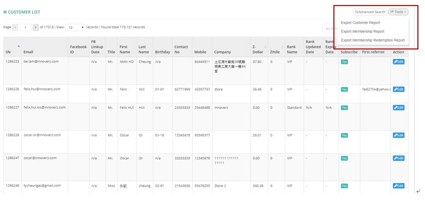

************
Customer List Module 
************
The Customer List Module displays the details of our registered customers. Users can use the “Advanced Search” and “Tools” buttons to filter target customers and export customer reports. With the buttons in the Action column users can also make changes to the corresponding Customer items.

|customerlist|

.. list-table:: Customer List Module
    :widths: 10 50
    :header-rows: 1
    :stub-columns: 1

    * - FIELD NAME
      - FIELD DESCRIPTION
    * - SN
      - The Customer Serial Number (ID)
    * - Email
      - The Customer Email
    * - Facebook ID
      - The Facebook ID of Customer
    * - FB Linkup Date
      - The date when customer register their Facebook account with Ztore
    * - Title
      - The Title (E.g. Mr, Mrs) of Customer
    * - First Name
      - The First Name of Customer
    * - Last Name
      - The Last Name of Customer
    * - Birthday
      - The Birthday of Customer
    * - Contact No
      - The Phone Contact Number of Customer
    * - Mobile
      - The Mobile Number of Customer
    * - Company
      - The Company of Customer
    * - Z-dollar
      - The Amount of Z-dollar of Customer
    * - Rank Name
      - The Rank of Customer
    * - Rank Updated Date
      - The Latest Date of Rank Update of The Customer
    * - Rank Expiry Date
      - The Expiry Date of Customer Rank
    * - Subscribe
      - Is allowing to send system email or not
    * - First referrer
      - The Name of First Referrer of The Customer
    * - Register Date
      - The Date of Customer Registration in of ZTORE\
    * - Total GMV
      - The Gross Merchandising Value of The Customer
    * - No. of Purchase
      - The Number of Purchase made by The Customer
    * - Total Discount
      - The Total Discount Amount Received by The Customer
    * - First Purchased Date
      - The date of customer making his/her first purchase decision in Ztore
    * - Last Purchased Date
      - The date of customer making his/her latest purchase decision in Ztore
    * - No. of Referral
      - The number of referral the customer received
    * - Remark
      - The additional information of The Customer
    * - User Address (Last Used)
      - The latest registered address for the Customer
    * - Delete 
      - "Yes" or "No" if The Customer is Deleted
    * - Action
      - Edit - Edit Customer Item Information
      
Buttons
==================
The Buttons on top of The Table allow users to find The Target Customers they are looking for and export them out into a report.

|customerlist_buttons|

.. list-table:: Customer List Module Buttons
    :widths: 10 50
    :header-rows: 1
    :stub-columns: 1

    * - BUTTONS
      - DESCRIPTIONS
    * - Advanced Search
      - User can use multiple search criterion to locate the target Customers
    * - Tools
      - User can export different kinds of Customer Reports.
    * - Other Search
      - User can filter Customers with different Status or Customer Tier
    * - SN, email, name, contact input box
      - User can input corresponding Customer details to locate target Customers
      
Advanced Search
==================
Users can input different criterion into the pop-up Advanced Search window to locate target Purchase Order Items.

|customerlist_search|

.. list-table:: Customer List Module Advanced Search
    :widths: 10 50
    :header-rows: 1
    :stub-columns: 1

    * - FIELD NAME
      - FIELD DESCRIPTIONS
    * - Register Date
      - The Register Date Range of Customer in Ztore
    * - Registered BY
      - The Customer register by "Facebook" or "Email"?
    * - Linked with Facebook
      - "Yes" or "No" Customer Account linked with their Facebook Account
    * - Z-Dollar
      - The Range of Z-Dollar Customer have
    * - Zmile
      - The Range of Zmile Customer have
    * - Membership Tier
      - The Membership Level of Customer
    * - Membership Report Date
      - The Date Range of Membership Report
      
Edit
==================
Users can also click the “Edit” Button of the corresponding Customer Item under the Action column to edit the details of that Customer.

|customerlist_edit|

.. list-table:: Edit
    :widths: 10 50
    :header-rows: 1
    :stub-columns: 1

    * - FIELD NAME
      - FIELD DESCRIPTION
    * - SN
      - The Customer Serial Number (ID)
    * - Email
      - The Customer Email
    * - First Name
      - The First Name of Customer
    * - Last Name
      - The Last Name of Customer
    * - Title
      - The Title (E.g. Mr, Mrs) of Customer
    * - Neighbor
      - "Yes" or "No" for Neighbor
    * - Subscribe
      - "Yes: or "No" for Subscription
    * - First Referrer
      - The First Referrer of The Customer
    * - Mobile
      - The Mobile contact of The Customer
    * - Birthday
      - The Birthday of The Customer
    * - Contact No
      - The Contact Number of The Customer
    * - Z-Dollar
      - The Z-Dollar Amount of The Customer
    * - Rank Name
      - The Customer Level of The Customer
    * - Zmile
      - The Zmile Amount of The Customer
    * - Company
      - The Company of The Customer working for
    * - Register Date
      - The Date of Registration of The Customer
    * - Last Login
      - The Latest Login Date of The Customer
    * - Facebook ID
      - The Facebook ID of The Customer
    * - COD limit
      - The Upper Limit of Cash on Delivery of The Customer
    * - Remark
      - The additional information of The Customer
      
Edit - Current User Address
------------------

|customerlist_edit2|

.. list-table:: Edit Current User Address
    :widths: 10 50
    :header-rows: 1
    :stub-columns: 1

    * - FIELD NAME
      - FIELD DESCRIPTION
    * - Default
      - Default shipping address selected by system, when customer in checkout flow - step1
    * - Consignee
      - The Consignee Name
    * - Title
      - The Consignee Title
    * - Contact No.
      - The Contact Number of The Consignee
    * - Mobile
      - The Mobile Number of The Consignee
    * - Language
      - The Frequently Used Language of The Consignee
    * - Country
      - The Country of Consignee
    * - Region
      - The Region of Consignee
    * - District
      - The District of Consignee
    * - Area
      - The Area of Consignee
    * - No Lift
      - "Yes" or "No" of No Lift in The Consignee Building
    * - Distinction
      - Non-Industrial / Commercial Locations
    * - Actions
      - None
      
Edit - Order History
------------------

|customerlist_edit3|

.. list-table:: Edit Order History
    :widths: 10 50
    :header-rows: 1
    :stub-columns: 1

    * - FIELD NAME
      - FIELD DESCRIPTION
    * - Order No
      - The Order No
    * - Order Rating
      - The Rating Given by The Customer
    * - Order Date
      - The Date of Making The Order
    * - Delivery Date
      - The Date of Order Delivery
    * - Delivery Slot
      - The Time of Order Delivery
    * - Packaging
      - The Special Packaging of The Order Product
    * - Payment Type
      - The Payment Type for The Order
    * - Area Code
      - The Code of Order Area
    * - Region 
      - The Region of The Order
    * - District
      - The District of The Order
    * - Area
      - The Area of The Order
    * - Address
      - The Order Address
    * - Remarks
      - The Additional Information of The Order
    * - Sales Amount
      - The Sales Amount of The Order
    * - Delivery Charge
      - The Delivery Charge on The Order
    * - Promotion
      - The Promotion Amount of The Order
    * - Z-Dollar Used
      - The Amount of Z-Dollar used in The Order
    * - Sales Amount
      - The Total Sales Amount of The Order
    * - Bill Amount 
      - The Billing Amount of The Order
    * - Status
      - The Order Status
      
Edit - Current Cart Product
------------------

|customerlist_edit4|

.. list-table:: Edit Current Cart Product
    :widths: 10 50
    :header-rows: 1
    :stub-columns: 1

    * - FIELD NAME
      - FIELD DESCRIPTION
    * - SN
      - The Product ID
    * - Product Name (Eng)
      - The English Name of Product currently in the Shopping Cart
    * - Product Name (Chi)
      - The Chinese of Product currently in the Shopping Cart
    * - Price
      - The Price of Product
    * - Qty
      - The Product Quantity
    * - Stock Type
      - The Stock Type of The Product
    * - Sub-Total
      - The Total Value of The Single Product in The Shopping Cart
      
Edit - Current Unused Reward
------------------

|customerlist_edit5|

.. list-table:: Edit Current Unused Reward
    :widths: 10 50
    :header-rows: 1
    :stub-columns: 1

    * - FIELD NAME
      - FIELD DESCRIPTION
    * - Type
      - The Reward Type
    * - Title
      - The Title of Reward
    * - Brand
      - The Brand of The Reward Applied to
    * - Code
      - The Reward Code
    * - Redemption ID
      - The Redemption ID of The Reward
    * - Date
      - The Date of Earning The Reward
      
Edit - Z-Dollar History
------------------

|customerlist_edit6|

.. list-table:: Edit Z-Dollar History
    :widths: 10 50
    :header-rows: 1
    :stub-columns: 1

    * - FIELD NAME
      - FIELD DESCRIPTION
    * - Order ID
      - The Order ID
    * - Z-Dollar Change
      - The Change Amount of Z-Dollar
    * - Z-Dollar Remain
      - The Remaining Amount of Z-Dollar
    * - Type
      - The Type of Z-Dollar Offer
    * - Remark
      - The Additional Information of Z-Dollar History
    * - Created By
      - The Person who Created The Z-Dollar Offer
    * - Created At
      - The Time when The Z-Dollar Offer Created]
      
Edit - Zmile History
------------------

|customerlist_edit7|

.. list-table:: Edit Zmile History
    :widths: 10 50
    :header-rows: 1
    :stub-columns: 1

    * - FIELD NAME
      - FIELD DESCRIPTION
    * - Order ID
      - The Order ID
    * - Zmile Change
      - The Change Amount of Zmile
    * - Zmile Remain
      - The Remaining Amount of Zmile
    * - Type
      - The Type of Zmile Offer
    * - Remark
      - The Additional Information of Zmile History
    * - Created By
      - The Person who Created The Zmile Offer
    * - Created At
      - The Time when The Zmile Offer Created
      
Edit - Admin Update Log
------------------

|customerlist_edit8|

.. list-table:: Edit - Admin Update Log
    :widths: 10 50
    :header-rows: 1
    :stub-columns: 1

    * - FIELD NAME
      - FIELD DESCRIPTION
    * - Field Name
      - The Name of The Field being Updated
    * - Old Value
      - The Old Value of The Updated Field
    * - New Value
      - The New Value of The Updated Field
    * - Updated By
      - The Person who Made The Update
    * - Updated At
      - The Time of Making The Update
      
Other Search
==================
Users can filter different groups of customers easily by selecting the criteria in the dropdown list from the “Other Search” button.

|customerlist_othersearch|

.. list-table:: Edit - Admin Update Log
    :widths: 10 50
    :header-rows: 1
    :stub-columns: 1

    * - FIELD NAME
      - FIELD DESCRIPTION
    * - Get All
      - Show All Customer
    * - Get Neighbour
      - Show Customer with The Neighbor Field is "Yes"
    * - Get Non-Neighbour
      - Show Customer with The Neighbor Field is "No"
    * - Get Non-Delete User
      - Show Customer with The Delete Field is "No"
    * - Get Membership(Customer)
      - Show Customer with The Rank Name Field is "Standard"
    * - Get Membership(Silver)
      - Show Customer with The Rank Name Field is "Silver"
    * - Get Membership(Gold)
      - Show Customer with The Rank Name Field is "Gold"
    * - Get Membership(Platinum)
      - Show Customer with The Rank Name Field is "Platinum"
      
Customer Report
==================
Users can export different kinds Customer Report by select the types of report from the dropdown list of the “Tools” button.

|customerlist_report|

Export Customer Report
------------------
Users can export the basic details of targeted customer into Excel format by clicking “Export Customer Report” in the “Tools” button dropdown list.

.. list-table:: Customer Report
    :widths: 10 50
    :header-rows: 1
    :stub-columns: 1

    * - FIELD NAME
      - FIELD DESCRIPTION
    * - SN
      - The Customer ID
    * - Email
      - The Customer Email
    * - Facebook ID
      - The Facebook ID of The Customers
    * - Date of link up with Facebook
      - The Date of Linking Up The Customer FB Account with Ztore
    * - Title
      - The Title of The Customer
    * - First Name
      - The Customer First Name
    * - Last Name
      - The Customer Last Name
    * - Birthday
      - The Customer Birthday
    * - Contact No
      - The Contact Number of The Customer
    * - Mobile
      - The Mobile Number of The Customer
    * - Company
      - The Customer Working Company
    * - Z-Dollar
      - The Amount of Z-Dollar of The Customer
    * - Zmile
      - The Zmile of The Customer
    * - Rank Name
      - The Customer Rank
    * - Rank Updated Date
      - The Latest Date of Rank Updated
    * - Rank Expiry Date
      - The Expiry Date of The Customer Rank
    * - Register Date
      - The Register Date of The Customer Account
    * - Total GMV
      - The Total Gross Merchandising Value purchased by The Customer
    * - No. of Purchase
      - The Number of Purchase Made by The Customer
    * - Total Discounted
      - The Total Discounted Value of The Customer
    * - First Purchase Date
      - The Date of First Purchase of The Customer
    * - First Order SN
      - The Order ID of The First Order 
    * - Last Purchase Date
      - The Latest Date of Purchase made by The Customer
    * - No. of Referral
      - The Number of Referral The Customer have
    * - Referral by customer ID
      - The Customer ID of The Referrer
    * - Referral by customer Email
      - The Customer Email of The Referrer
    * - Remark
      - The Additional Information of The Customer)
    * - Address (Last Used)
      - The Latest Address Used by The Customer
    * - Address Distinction
      - Commercial/Non-commercial
      
Export Membership Report
------------------
Users can export the ordering details of targeted customer into Excel format by clicking “Export Membership Report” in the “Tools” button dropdown list.

.. list-table:: Membership Report
    :widths: 10 50 50
    :header-rows: 1
    :stub-columns: 1

    * - FIELD NAME
      - FIELD DESCRIPTION
      - CALCULATION
    * - SN
      - The Customer ID
      -
    * - Email
      - The Customer Email
      -
    * - Title
      - The Customer Title
      -
    * - First Name
      - The Customer First Name
      - 
    * - Last Name
      - The Customer Last Name
      - 
    * - Birthday
      - The Customer Birthday
      -
    * - First purchase date
      - The Date of First Purchase Made by The Customer
      -
    * - Last purchase date
      - The Date of Latest Purchase Made by The Customer
      -
    * - Last order no.
      - The Order ID of The Latest Purchase
      -
    * - First membership date
      - The Date of The Customer registering the First membership
      -
    * - Z-Dollar
      - The Amount of Z-Dollar of The Customer
      -
    * - Zmile
      - The Zmile of The Customer
      -
    * - Current membership tier
      - The Customer Rank
      -
    * - Highest membership tier reached
      - The Highest Customer Level the Customer Attained
      -
    * - Last membership tier
      - The Latest Customer Level The Customer is having
      -
    * - Current membership tier start date
      - The Starting date of The current membership of The Customer
      -
    * - Current membership tier expiry date
      - The Final date of The current membership of The Customer
      -
    * - Day since last purchase
      - The Date of Latest Purchase Made by The Customer
      -
    * - Activeness
      - Membership activeness status
      - (Today - last purchase date), 
        if >180: lost; 
        if 71-180: Inactive; 
        if ≤70: Active 
    * - Total Zmiles earned
      - The Total Amount of Zmiles The Customer Earned
      -
    * - Total Redemption
      - The Total Redemption Amount The Customer Received
      -
    * - No. of order in the period
      - How many valid orders created within the period
      - Period ref by Membership Report Date in Advanced Search
    * - Average basket in the period
      - The Average Basket Level of The Customer in The Current Membership Period
      -
    * - Total GMV in the period
      - The Gross Merchandising Value of The Customer Purchased in The Current Membership Period
      -
    * - Zmiles earned in the period
      - The Zmile of The Customer in The Current Membership Period
      -
    * - Zmile Module Amendment in the period
      - How many zmile adjusted in the period
      - Only count the adjusted in CMS Zmile Module
    * - Expired Zmiles in the period
      - How many zmile expired in the period
      - Only count the reason as expired
    * - Level-up Deducted Zmiles in the period
      - How many zmile used in Levelup (grade) / Renew the grade / Down grade
      - Levelup / Renew : reduce the next / current grade condition zmile
        Downgrade : reduce all Zmile

Export Membership Redemption Report
------------------
Users can see the redemption progress of selected customers in Excel format.

.. list-table:: Customer Report
    :widths: 10 50
    :header-rows: 1
    :stub-columns: 1

    * - FIELD NAME
      - FIELD DESCRIPTIONS
    * - SN
      - The Customer ID
    * - Email
      - The Customer Email
    * - Title
      - The Customer Title
    * - First Name
      - The First Name of The Customer
    * - Last Name
      - The Last Name of The Customer
    * - Current membership tier
      - The Current Membership Rank of The Customer
    * - Coupon quota
      - The Upper Limit of Coupons received by The Customer
    * - Product quota
      - The Upper Limit of Product Redemptions received by The Customer
    * - Event quota
      - The Upper Limit of Event Redemptions received by The Customer
    * - Coupon redemption
      - The Amount of Coupons received by The Customer
    * - Product redemption
      - The Amount of Product Redemptions received by The Customer
    * - Event redemption
      - The Amount of Event Redemptions received by The Customer

