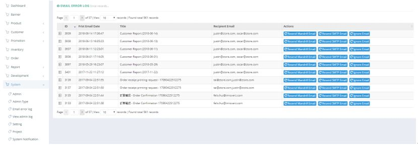

************
Email Error Log Module
************
Email Error Log Module displays the details of Error Emails. Users can select corresponding action by clicking the corresponding buttons in the “Action” column.

|email|

.. list-table:: Email Error Log Module
    :widths: 10 50
    :header-rows: 1
    :stub-columns: 1

    * - FIELD NAME
      - FIELD DESCRIPTIONS
    * - ID
      - The Email Error Log ID
    * - First Email Date
      - The Time of First Email Error Log
    * - Title
      - The Title of Email Error
    * - Recipient Email
      - The internal recipient Email Address of the Email Error
    * - Actions
      - Resend Mandrill Email/ Resend SMTP Email/ Ignore Email

