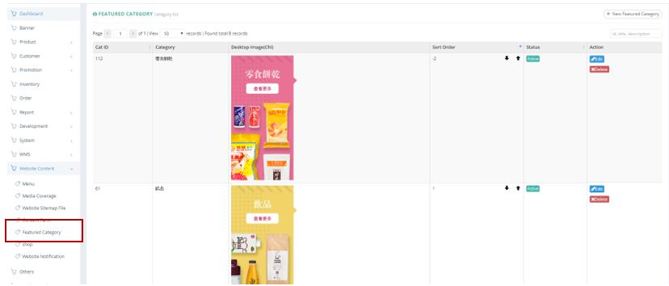
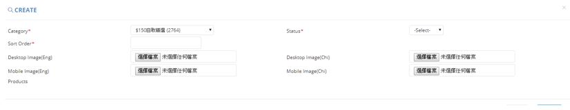

************
Feature Category Module
************
Feature Category Module displays the Product Features Category shown in Ztore.

|feacat|

.. list-table:: Feature Category Module
    :widths: 10 50
    :header-rows: 1
    :stub-columns: 1

    * - FIELD NAME
      - FIELD DESCRIPTIONS
    * - Cat ID
      - The Category ID
    * - Category
      - The Category Name
    * - Desktop Image(Chi)
      - The Chinese Desktop Image of Category
    * - Sort Order
      - The Relative Importance of Featured Category
    * - Status
      - Active/Inactive Featured Category
    * - Action
      - Edit/ Delete Featured Category Item
      
Create
==================
Users can Create new Product Featured Category by clicking on the “New Featured Category” button on top of the Featured Category Table and input Category Details into the popup window.

|feacat_create|

.. list-table:: Create Product Feature Category
    :widths: 10 50
    :header-rows: 1
    :stub-columns: 1

    * - FIELD NAME
      - FIELD DESCRIPTIONS
    * - Category
      - Select the Featured Category
    * - Status
      - Active/ Inactive Featured Category
    * - Sort Order
      - The Relative Importance of Featured Category
    * - Desktop Image(Eng)
      - Upload The English Desktop Image of Featured Category here
    * - Desktop Image(Chi)
      - Upload The Chinese Desktop Image of Featured Category here
    * - Mobile Image(Eng)
      - Upload The English Mobile Image of Featured Category here
    * - Mobile Image(Chi)
      - Upload The Chinese Mobile Image of Featured Category here

