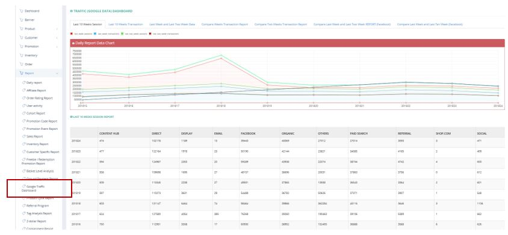

************
Google Traffic Dashboard Module
************
Google Traffic Dashboard Module displays the data of Ztore appearing in Google Website.

|google|

.. list-table:: Customer Report
    :widths: 10 50
    :header-rows: 1
    :stub-columns: 1

    * - FIELD NAME
      - FIELD DESCRIPTIONS
    * - Content Hub
      - Access Ztore from Ztore article page
    * - Direct
      - Input Direct Ztore link to access Ztore website
    * - Display
      - Access Ztore from the content provided on the Google search result page
    * - Email
      - Access Ztore by email link
    * - Facebook
      - Access Ztore through FB
    * - Organic
      - Access Ztore from Organic search
    * - Others
      - Access Ztore from methods other than the above ones
    * - Paid Search
      - Access Ztore from paid search results
    * - Referral
      - Access Ztore from clicking links on referral program
    * - Shop.com
      - Access Ztore through Shop.com
    * - Social
      - Access Ztore from social channel (defined by Google)

