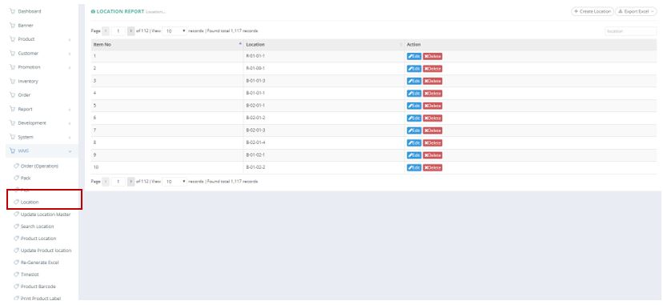
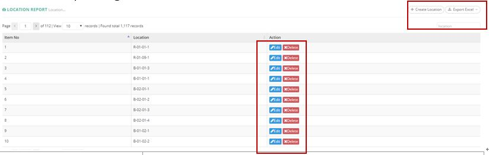
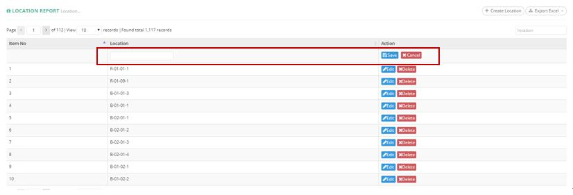
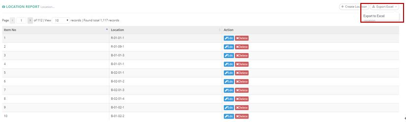

************
Location Module 
************
Location displays the details of different Locations in the Warehouse.

|location|

.. list-table:: Location Module
    :widths: 10 50
    :header-rows: 1
    :stub-columns: 1

    * - FIELD NAME
      - FIELD DESCRIPTION
    * - Item No
      - 
    * - Location
      - 
    * - Action
      -
      
Buttons
==================
User can Create and Export Location Details by clicking on the buttons on top of the Location Report Table. You can also Edit or Delete Existing Location Items by clicking on the corresponding buttons in the “Action” column.

|location_buttons|

.. list-table:: Location Module Buttons
    :widths: 10 50
    :header-rows: 1
    :stub-columns: 1

    * - FIELD NAME
      - FIELD DESCRIPTION
    * - Create Location
      - Users can Create New Location Items
    * - Export Excel
      - Users can Export Location Details
    * - Edit
      - Users can Edit Existing Location Items Details
    * - Delete
      - Users can Delete Existing Location Items
      
Create Location
==================
Users can Create Location Item by clicking on the “Create Location” button on top of the Location Report Table and input the Details.

|location_create|

.. list-table:: Create Location
    :widths: 10 50
    :header-rows: 1
    :stub-columns: 1

    * - FIELD NAME
      - FIELD DESCRIPTION
    * - Location 
      - The Location of New Location Item
    * - Action
      - Cancel or Save the New Location Item
      
Location Report
==================
Users can Export Location Details by clicking on the “Export Excel” button on top of the Location Report Table.

|location_report|

.. list-table:: Create Location
    :widths: 10 50
    :header-rows: 1
    :stub-columns: 1

    * - FIELD NAME
      - FIELD DESCRIPTION
    * - ID 
      - The Location ID
    * - Location 
      - The Location of Location Item
    * - Created Day
      - The Time and Date of Creating the Location Item

