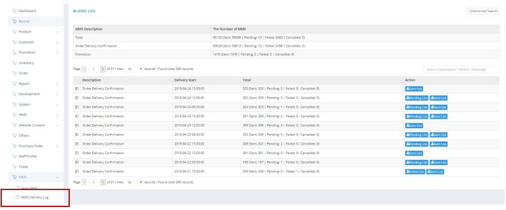
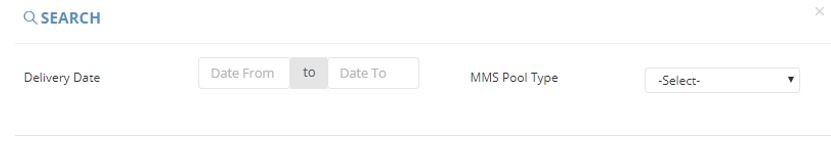

************
MMS Delivery Log Module 
************
MMS Delivery Log Module displays the Message Types and their delivery status.

|mmsde|

.. list-table:: MMS Delivery Log Module
    :widths: 10 50
    :header-rows: 1
    :stub-columns: 1

    * - FIELD NAME
      - FIELD DESCRIPTION
    * - MMS Description
      - The Type of MMS
    * - The Number of MMS
      - The Number of Message in MMS Type
    * - Description
      - The Description of Message
    * - Delivery Start
      - The Starting Time of Message Delivery
    * - Total 
      - Total Number of Description MMS
    * - Action
      - Download Pending List/ Download Failed List/ Download Sent List/ Cancel Delivery of MMS 
      
Advanced Search
==================
Users can search for Delivery Log by clicking on the “Advanced Search” button on top of the Delivery Log Table and input search criterion into the popup window.

|mms_search|

.. list-table:: MMS Delivery Log Module Advanced Search
    :widths: 10 50 50
    :header-rows: 1
    :stub-columns: 1

    * - FIELD NAME
      - FIELD DESCRIPTION
      - DROPDOWN LIST
    * - Delivery Date
      - The Delivery Date Range of MMS
      -
    * - MMS Pool Type
      - Type of events to send MMS
      - - Order Delivery Confirmation - sent to customers to remind of order delivery
        - Promotion - sent to let customers know the promotions of Ztore
        - Typhoon - sent to remind customers that typhoon may affect the actual time of order delivery
        - Emergency -  sent to remind customers that some incidents, such as traffic accidents, happen and affect the actual time of order delivery"

