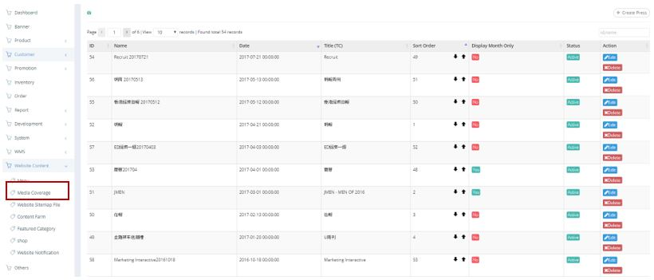
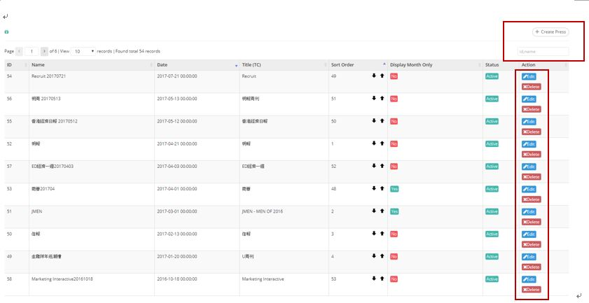
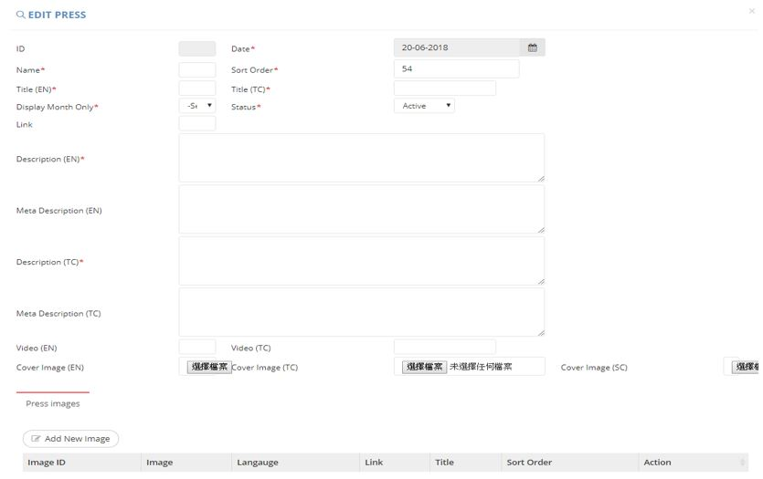
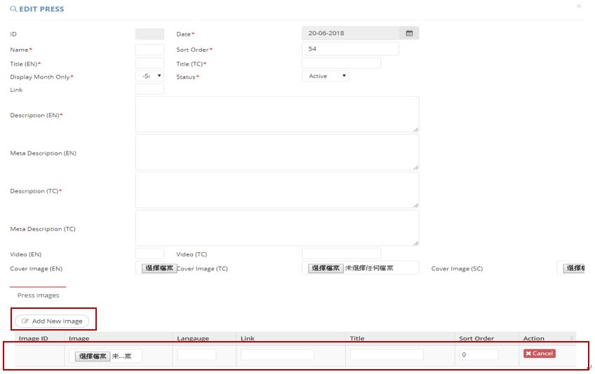

************
Media Coverage Module
************
Media Coverage Module displays the details of Ztore related media exposures. User can Create or Search for Media Coverage items by clicking on the buttons or Input Box on top of the Media Coverage Table. You can also Edit and Delete existing Media Coverage items by clicking on the corresponding buttons in the “Action” column.

|media|

.. list-table:: Media Coverage Module
    :widths: 10 50
    :header-rows: 1
    :stub-columns: 1

    * - FIELD NAME
      - FIELD DESCRIPTIONS
    * - ID
      - The Media Coverage ID
    * - Name
      - The Name of Media
    * - Date
      - The Date of Media Coverage
    * - Title (TC)
      - The Traditional Chinese Title of Media
    * - Sort Order
      - The Relative Importance of Media Coverage
    * - Display Month Only
      - Should not use
    * - Status
      - Active/ Inactive Media Coverage?
    * - Action
      - Edit/ Delete Media Coverage Item
      
Buttons
==================
Users can click on the buttons on top of the Media Coverage table to Create new Media Coverage Item, input Media Coverage item details for quick search into the Input Box on top of the Media Coverage Table. You can also click on the corresponding buttons in the “Action” column tot Edit or Delete Existing Items.

|media_buttons|

.. list-table:: Media Coverage Buttons
    :widths: 10 50
    :header-rows: 1
    :stub-columns: 1

    * - FIELD NAME
      - FIELD DESCRIPTIONS
    * - Create Press 
      - User can Create new Media Coverage Items by inputting Details into the popup Window
    * - ID, name Input Box
      - User can quick search by inputting Media Coverage Item Details into the Input Box
    * - Edit
      - Edit Existing Media Coverage Items Details
    * - Delete
      - Delete Existing Media Coverage Items
      
Create
==================
Users can click on the “Create Press” button on top of the Media Coverage Table to Create New Media Coverage Items and input the new Media Coverage Item Details into the popup window.\

|media_create|

.. list-table:: Create Press
    :widths: 10 50
    :header-rows: 1
    :stub-columns: 1

    * - FIELD NAME
      - FIELD DESCRIPTIONS
    * - ID
      - The Media Coverage ID
    * - Date
      - The Date of Media Coverage
    * - Name
      - The Name of Media Coverage
    * - Sort Order
      - The Relative Importance of Media Coverage
    * - Title(EN)
      - The English Title of Media Coverage
    * - Title(TC)
      - The Traditional Chinese Title of Media Coverage
    * - Display Month Only
      - Should not use
    * - Status
      - Active/ Inactive Media Coverage
    * - Link
      - The Link of Media Coverage
    * - Description(EN)
      - The English Description of Media Coverage
    * - Meta Description(EN)
      - The English Meta Description of Media Coverage
    * - Description(TC)
      - The Traditional Chinese Description of Media Coverage
    * - Meta Description(TC)
      - The Traditional Chinese Meta Description of Media Coverage
    * - Video(EN)
      - The English Video of Media Coverage
    * - Video(TC)
      - The Traditional Chinese Video of Media Coverage
    * - Cover Image(EN)
      - The English Cover Image
    * - Cover Image(TC)
      - The Traditional Chinese Cover Image
    * - Cover Image(SC)
      - The Simplified Chinese Cover Image
      
Create - Add New Image
------------------
Users can add Image into the Media Coverage Item by clicking on the “Add New Image” button on the “Create Press” popup window and enter Image Details.

|media_create1|

.. list-table:: Create - Add New Image
    :widths: 10 50
    :header-rows: 1
    :stub-columns: 1

    * - FIELD NAME
      - FIELD DESCRIPTIONS
    * - Image ID
      - The Image ID
    * - Image
      - Upload New Image here
    * - Language
      - The Language of Image
    * - Link
      - The Image Link
    * - Title
      - The Image Title
    * - Sort Order
      - The Relative Importance of Image
    * - Action
      - Cancel Adding New Image

