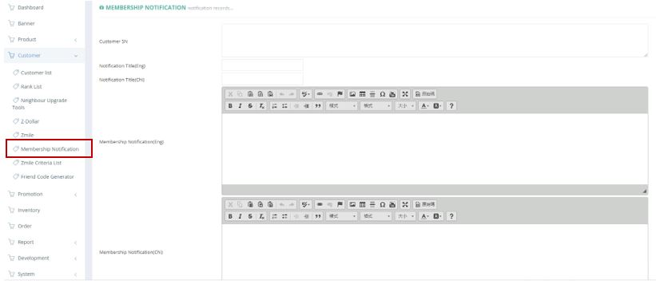

************
Membership Notification Module 
************
Users can create and send Membership Notifications here by entering the Notification details and Target Customer ID.

|memnot|

.. list-table:: Membership Notification Module
    :widths: 10 50
    :header-rows: 1
    :stub-columns: 1

    * - FIELD NAME
      - FIELD DESCRIPTION
    * - Customer SN
      - The Customer Serial Number (ID)
    * - Notification Title (Eng)
      - The English Customer Notification Title
    * - Notification Title (Chi)
      - The Chinese Customer Notification Title
    * - Membership Notification (Eng)
      - The English Customer Notification Content
    * - Membership Notification (Chi)
      - The Chinese Customer Notification Content
    * - Admin Name
      - The Name of The Customer Notification Admin
    * - Action Info
      - Information of the admin operation log, but the action info only from Membership Notification Module
    * - Date Created
      - The Date Customer Notification Created
      
      

