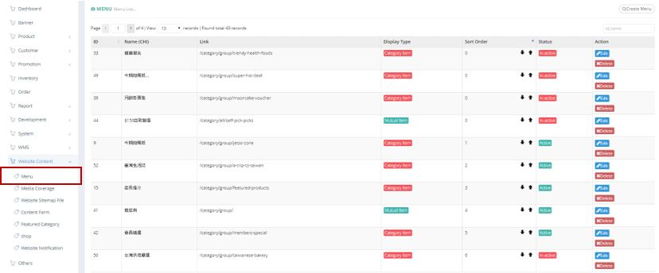
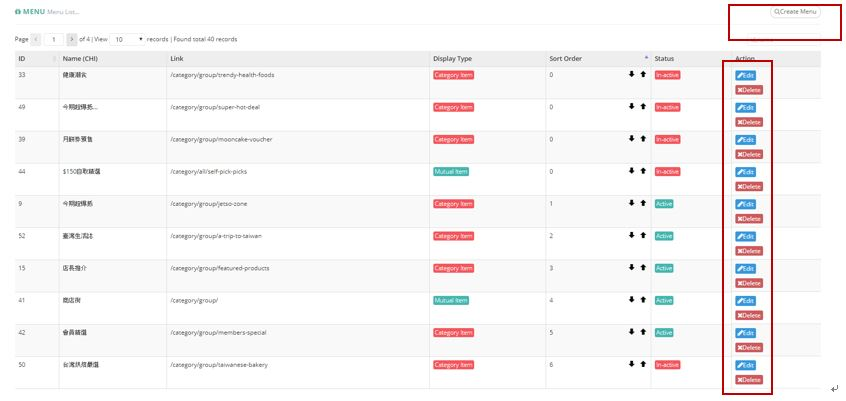
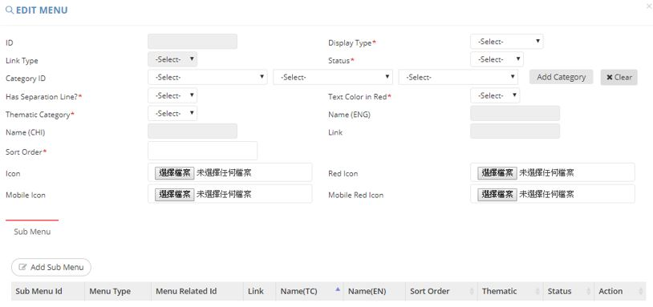
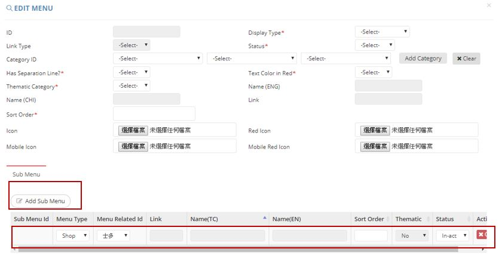

************
Menu Module
************
Menu Module displays the details of Item displayed in the Menu of Ztore website. Users can Create and Search for Menu items, you can also Edit and Delete existing Menu Items by clicking on the corresponding buttons in the “Action’ column.

|menu|

.. list-table:: Menu Module
    :widths: 10 50
    :header-rows: 1
    :stub-columns: 1

    * - FIELD NAME
      - FIELD DESCRIPTIONS
    * - ID
      - The Menu ID
    * - Name (CHI)
      - The Name of Menu in Chinese
    * - Link
      - The Link of Menu
    * - Display Type
      - The Display Type of Menu
    * - Sort Order
      - The Relative Importance of Menu
    * - Status
      - Active/ Inactive Menu
    * - Action
      - Edit or Delete Menu Item
      
Buttons
==================
Users can click on the button on top of the Menu table to create new Menu item, input Menu ID or Name into The Input Box above the Menu Table for quick Search. You can also Edit or Delete existing Menu Item by clicking on the corresponding buttons in the “Action” column.

|menu_buttons|

.. list-table:: Menu Module Buttons
    :widths: 10 50
    :header-rows: 1
    :stub-columns: 1

    * - BUTTONS
      - DESCRIPTIONS
    * - Create Menu
      - Users can Create Menu Item by inputting Menu Details into the popup window.
    * - ID, name Input Box
      - User can input Menu Item Details for quick search
    * - Edit
      - Edit existing Menu Item Details
    * - Delete
      - Delete Existing Menu Item
      
Create
==================
Users can click on the “Create Menu” button on top of the Menu Table and input the details of new Menu Item into the popup window.

|menu_create|

.. list-table:: Create Menu
    :widths: 10 50
    :header-rows: 1
    :stub-columns: 1

    * - FIELD NAME
      - FIELD DESCRIPTIONS
    * - ID
      - The Menu ID
    * - Display Type
      - "Category Item" or "Mutual Item" Menu Display Type
    * - Link Type
      - display format in category page;
        group: products group by different sub categories to display (ref: https://www.ztore.com/tc/category/group/beverage);
        all: display a list of product directly (ref: https://www.ztore.com/tc/category/all/beverage)
    * - Status
      - The Menu Status
    * - Category ID
      - The Product Category ID of Menu
    * - Has Separation Line?
      - "Yes" or "No" Separate Line
    * - Text Color in Red?
      - "Yes" or "No" Red Text Color
    * - Thematic Category
      - "Yes" or "No" Thematic Category
    * - Name (ENG)
      - The English Name of Menu
    * - Name (CHI)
      - The Chinese Name of Menu
    * - Link
      - The Link of Menu
    * - Sort Order
      - The Relative Importance of Menu
    * - Icon
      - Upload The Menu Icon here
    * - Red Icon
      - Upload The Red Icon here
    * - Mobile Icon
      - Upload The Menu Mobile Icon here
    * - Mobile Red Icon
      - Upload The Menu Mobile Red Icon here
      
Create - Add Sub Menu
------------------
Users can add Sub Menu into the New Menu item by clicking on the “Add Sub Menu” button on the “Create Menu” popup window. You can then input the Sub Menu Details.

|menu_create1|

.. list-table:: Create - Add Sub Menu
    :widths: 10 50
    :header-rows: 1
    :stub-columns: 1

    * - FIELD NAME
      - FIELD DESCRIPTIONS
    * - Menu Type
      - The Type of Menu
    * - Menu Related ID
      - The Menu Related ID
    * - Sort Order
      - The Relative Importance of Sub Menu
    * - Status
      - Active/Inactive Sub Menu
    * - Action
      - Cancel Sub Menu

