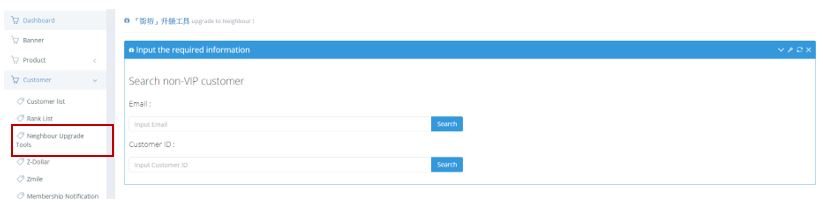
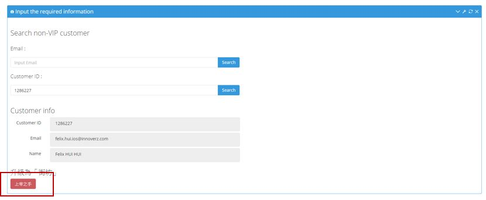

************
Neighbor Upgrade Tools Module 
************
Users can search for Customers by their Email or Customer ID to upgrade them into Neighbor. 

|neighborupgrade|

.. list-table:: Neighbor Upgrade Tools Module
    :widths: 10 50
    :header-rows: 1
    :stub-columns: 1

    * - FIELD NAME
      - FIELD DESCRIPTION
    * - Email
      - Input Customer Email here
    * - Customer ID
      - Input Customer ID here
      
After Searching the Customer with Email or ID, Users can click on the “上帝之手” button to upgrade the Customer.

|neighborupgrade2|

.. list-table:: Customer Info
    :widths: 10 50
    :header-rows: 1
    :stub-columns: 1

    * - FIELD NAME
      - FIELD DESCRIPTION
    * - Email
      - Customer Email
    * - Customer ID
      - Customer ID 
    * - Name
      - Customer Name

