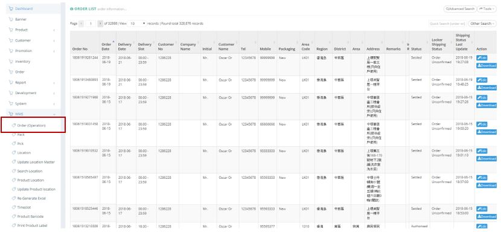
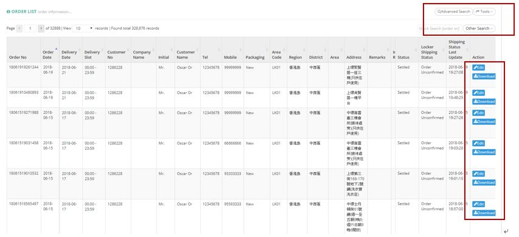
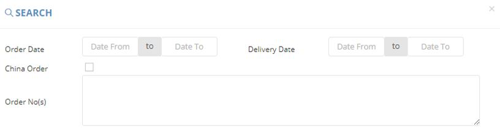
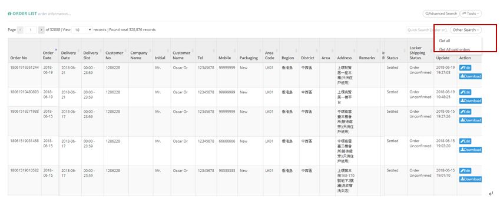
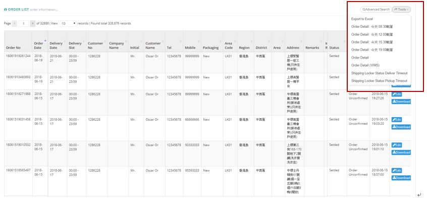

************
Order (Operation) Module 
************
Order Module displays the details of Orders made by Customers.

|order|

.. list-table:: Order (Operation) Module
    :widths: 10 50
    :header-rows: 1
    :stub-columns: 1

    * - FIELD NAME
      - FIELD DESCRIPTION
    * - Order No
      - The Order No
    * - Order Date
      - The Date of Order
    * - Delivery Date
      - The Date of Delivery
    * - Delivery Slot
      - The Time of Delivery
    * - Customer No
      - The Customer No of Order
    * - Company Name
      - The Company Name of Order
    * - Initial
      - The Initial of Customer
    * - Customer Name
      - The Name of Customer
    * - Tel
      - The Telephone Number of Customer
    * - Mobile
      - The Mobile Number of Customer
    * - Packaging
      - The Packaging of Order
    * - Area Code
      - The Area Code of Delivery Location
    * - Address
      - The Receiving Address of The Order
    * - Remarks
      - The Additional Information of The Order
    * - Internal Remarks
      - The Additional Internal Information of The Order
    * - Sales Amount
      - The Total Sales Amount of The Order
    * - Delivery Charge
      - The Delivery Charge of The Order
    * - Promotion
      - The Promotion Amount of The Order
    * - Z-Dollar Used
      - The Amount of Z-Dollar used in The Order
    * - Bill Amount
      - The Total Billing Amount of The Order
    * - Settlement
      - The Amount of Settlement of The Order
    * - Status
      - The Status of Order
    * - Locker Shipping Status
      - The Shipping Status of Locker
    * - Shipping Status Last Update
      - The Time of latest Shipping Status Update
    * - Action
      - Edit/ Download Order Item
      
Buttons
==================
Users can Search and Export Order Details by clicking on the buttons on top of the Order Table. You can also Download and Edit Existing Order Items by clicking on the corresponding button in the “Action” column.

|order_buttons|

.. list-table:: Order (Operation) Module Buttons
    :widths: 10 50
    :header-rows: 1
    :stub-columns: 1

    * - FIELD NAME
      - FIELD DESCRIPTION
    * - Advanced Search
      - User can Search for Order Items with different criterion
    * - Tools
      - User can Export different Order Details 
    * - Quick Search Input Box
      - User can quick search by Order ID
    * - Other Search
      - User can filter Order with Paid/ All Orders
    * - Edit
      - Edit Individual Order Item Details
    * - Download
      - Download Individual Order Item Details
      
Advanced Search
==================
Users can Search Order Items by clicking on the “Advanced Search” button on top of the Order List Table and input different criterion into the popup window.

|order_adsearch|

.. list-table:: Order (Operation) Module Advanced Search
    :widths: 10 50
    :header-rows: 1
    :stub-columns: 1

    * - FIELD NAME
      - FIELD DESCRIPTION
    * - Order Date
      - The Date Range of Creating The Order
    * - Delivery Date
      - The Date Range of Delivering The Order
    * - China Order
      - Select if this is a Order to China
    * - Order No(s)
      - The Order No(s) of to Search for
      
Other Search
==================
Users can filter Order with their Status(Paid) by clicking on the “Other Search” button on top of the Order List Table.

|order_othersearch|

.. list-table:: Order (Operation) Module Other Search
    :widths: 10 50
    :header-rows: 1
    :stub-columns: 1

    * - FIELD NAME
      - FIELD DESCRIPTION
    * - Get all
      - Show All Orders
    * - Get All paid order
      - Show Paid Orders
      
Delivery Report
==================
Users can Export different types of Order Details by clicking on the “Tools” button and Select the corresponding options.

|order_report|

.. list-table:: Order (Operation) Module Delivery Report
    :widths: 10 50
    :header-rows: 1
    :stub-columns: 1

    * - FIELD NAME
      - FIELD DESCRIPTION
    * - Order No
      - The Order ID
    * - Delivery Date
      - The Date of Order Delivery
    * - Delivery Time Slot
      - The Timeslot of Order Delivery
    * - Temperature
      - The Temperature Condition of Order Delivery
    * - Initial
      - The Title of Order Consignee
    * - Customer Name
      - The Customer Name
    * - Tel
      - The Telephone Number of Customer
    * - Mobile
      - The Mobile Number of Customer
    * - Area Code
      - The Area Code of Order Delivery
    * - Region
      - The Region of Order Delivery
    * - District
      - The District of Order Delivery
    * - Address
      - The Address of Order Delivery
    * - Remark
      - The Additional Information of Order Delivery
    * - No Lift
      - "Yes" or "No" of No lift in receiving address condition
    * - Put at Management Desk
      - "Yes" or "No" of putting The Order at management desk condition
    * - Shipping method
      - The Shipping Method of Order Delivery
    * - Locker shipping status
      - The Status of Locker Order Shipping Delivery
    * - Collect box/glass
      - Condition of need or not a collection box or glass

