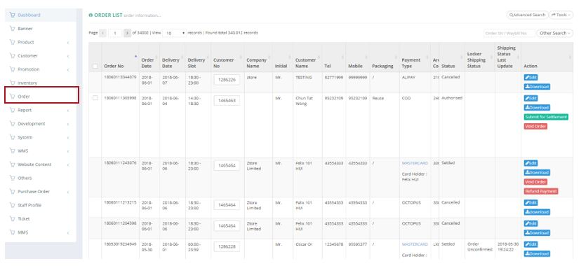
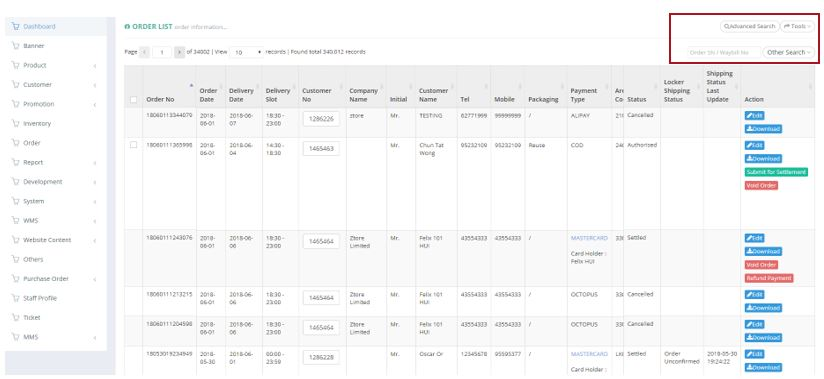
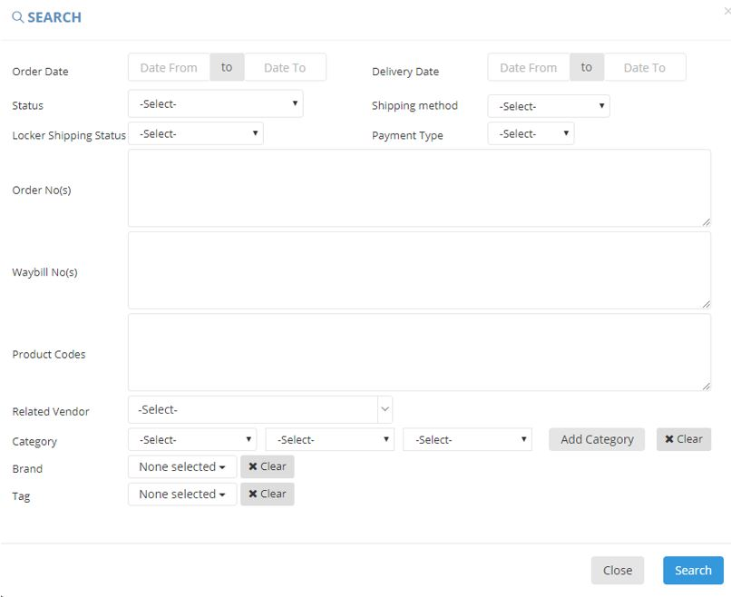
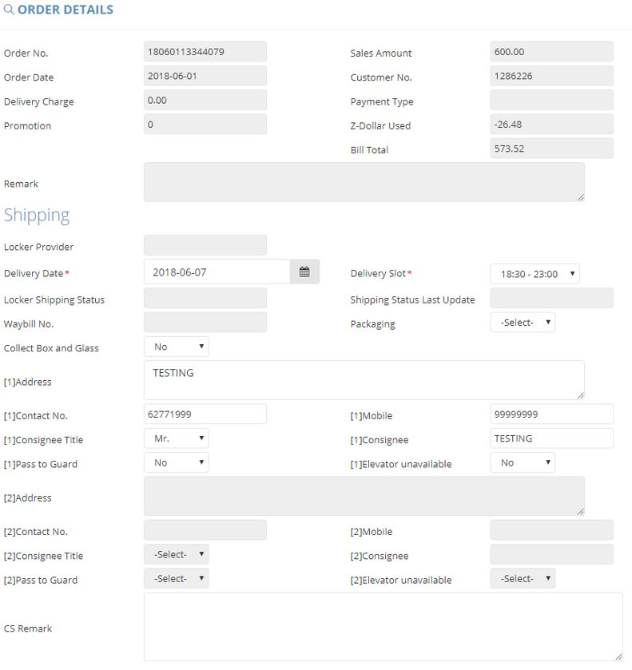
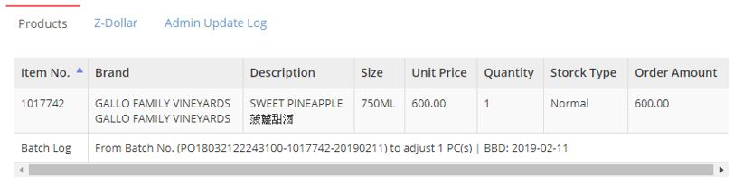
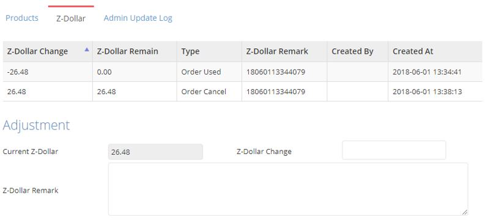
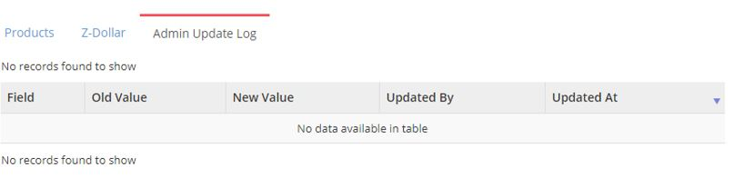
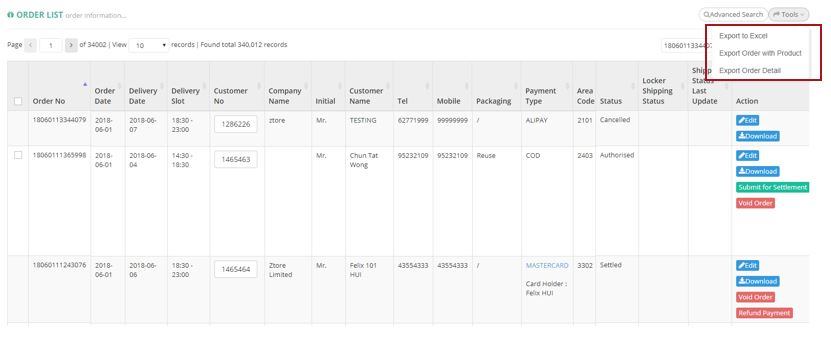

************
Order Module 
************
The Order Category lists are the Orders made by customer in the list. Users can use the “Advanced Search” and “Tools” buttons to filter target orders and export order reports. With the buttons in the Action column users can also make changes to the corresponding Order items.

|orderlist|

.. list-table:: Order List
    :widths: 10 50
    :header-rows: 1
    :stub-columns: 1

    * - FIELD NAME
      - FIELD DESCRIPTION
    * - Order No
      - The Order ID
    * - Order Date
      - The Date of Customer making The Order
    * - Delivery Date
      - The Date of Order Delivery
    * - Delivery Slot
      - The slot of Delivery
    * - Customer No
      - The Customer ID
    * - Company Name
      - The Name of Company
    * - Initial
      - The Initial of Customer
    * - Customer Name
      - The Name of Customer
    * - Tel
      - The Contact number of Customer
    * - Mobile
      - The Mobile number of Customer
    * - Packaging
      - The Packaging of Product
    * - Payment Type
      - The Payment Type for settling the order
    * - Area Code
      - The Area Code of Delivery Region
    * - Region
      - The Region of Order Delivery Destination
    * - District
      - The District of Order Delivery Destination
    * - Area
      - The Area of Order Delivery Destination
    * - Address
      - The Address of Order Delivery Destination
    * - Remarks
      - The Remark of Customer
    * - Internal Remarks
      - The Internal Remark of Customer
    * - Sales Amount
      - The total value of Order
    * - Delivery Charge
      - The Cost of delivery for the Order
    * - Promotion
      - The promotion used for the Order
    * - Z-Dollar Used
      - The amount of Z-Dollar customer used in The Order
    * - Bill Amount
      - The Amount of Bill
    * - Settlement
      - The amount we received
    * - Total WAC
      - The sum of WAC of all products
    * - Status
      - The Order Status
    * - Locker Shipping Status
      - The Locker Status of Order Delivery
    * - Shipping Status Last Update
      - The Latest Update Date of Shipping Status
    * - Action
      - - Edit - Edit Order Item Information;
        - Download - Download Order Item;
        - Submit for Settlement - Submit The Order Item for Settling;
        - Void Order - Delete The Order Item
        
Buttons
==================
The Buttons on top of The Table allow users to find The Target Order Items they are looking for and export them out into a report.

|orderlist_buttons|

.. list-table:: Order List Module Buttons
    :widths: 10 50
    :header-rows: 1
    :stub-columns: 1

    * - BUTTONS
      - DESCRIPTIONS
    * - Advanced Search
      - User can use multiple search criterion to locate the target order item
    * - Tools
      - User can export different kinds of Order Reports.
    * - Other Search 
      - User can display all orders or only all paid orders in the table
    * - Order SN/Waybill No Input Box
      - User can input corresponding Order ID or Waybill Number to locate Order
      
Advanced Search
==================
Users can input different criterion into the pop-up Advanced Search window to locate target Order Items.

|orderlist_search|

.. list-table:: Order List Module Advanced Search
    :widths: 10 50 50
    :header-rows: 1
    :stub-columns: 1

    * - FIELD NAME
      - FIELD DESCRIPTIONS
      - CALCULATION/ DROPDOWN LIST
    * - Order Date
      - The Date Range of Customer making The Order
      -
    * - Delivery Date
      - The Date Range of Order Delivery
      -
    * - Status
      - The Status of Customer Order
      - - Paid or Settled or Refunded;
        - Settled – The Order is Paid and Completed;
        - Authorized – The Order is Authorized by The Customer;
        - Cancelled – The Order is cancelled by The Customer;
        - Force Voided - ;
        - Fully Refunded – The Customer received complete refund for The Order;
        - Not Paid - ;
        - Refunded - ;
        - Void Payment Only - ;
        - Voided - ;
        - Waybill Canceled - ;
        - To be Refund - ;
    * - Shipping method
      - The Shipping Method of Customer Order
      - - Delivery – The Order will be delivered directly to The Customer’s registered address;
        - Locker – The Order will be delivered to Customer’s Locker;
        - EF Locker - ;
        - LockerLife & Hop -
    * - Locker Shipping Status
      - The Locker Status for the Order
      - - Arrived – The Order Product has arrived The Locker;
        - Cancelled - ;
        - Customer Received – Customer has picked up The Order from The Locker;
        - Delivery Failed – The Order is not able to reach The Locker;
        - On the way – The Order is in the process of arriving The Locker;
        - Order Confirmed – The Order is confirmed for Locker Delivery;
        - Order Unconfirmed – The Order has not confirmed for Order Delivery;
        - Ready to Deliver – The Order is now ready to start the delivery process
    * - Payment Type
      - The Type of Payment for The Order
      -
    * - Order No(s)
      - Input lists of order no. to search
      -
    * - Waybill No(s)
      - Input lists of waybill no. to search
      -
    * - Product Codes
      - The Product ID of Products in The Order
      -
    * - Related Vendor
      - The Related Vendor of Products in The Customer Order
      -
    * - Category
      - The Category of Products in The Order
      -
    * - Brand
      - The Brand of Products in The Order
      -
    * - Tag
      - The Related Tag of Products in The Order
      -
     
Edit
==================
By clicking the “Edit” Button in the corresponding Order Item under The Action column, users can edit the details of the Order Item.

|orderlist_edit|

.. list-table:: Order List Module Edit
    :widths: 10 50
    :header-rows: 1
    :stub-columns: 1

    * - FIELD NAME
      - FIELD DESCRIPTIONS
    * - Order No.
      - The Order ID
    * - Sales Amount
      - The Total Sales Amount of The Order
    * - Order Date
      - The Date of Creating The Order
    * - Customer No.
      - The Customer ID of The Order
    * - Delivery Charge
      - The Delivery Charge of The Order
    * - Payment Type
      - The Payment Type of The Order
    * - Promotion
      - The Promotion Amount of The Order
    * - Z-Dollar Used
      - The Amount of Z-Dollar Used in The Order
    * - Bill Total
      - The Total Billing Amount of The Order
    * - Remark
      - The Additional Information of The Order
    * - Locker Provider
      - The Provider of The Locker
    * - Delivery Date
      - The Date of Order Delivery
    * - Delivery Slot
      - The Timeslot of Order Delivery
    * - Locker Shipping Status
      - The Status of Order in The Locker
    * - Shipping Status Last Update
      - The Latest Date of Locker Status Update
    * - Waybill No.
      - Input lists of waybill no. to search
    * - Packaging
      - "Yes" or "No" for Order Packaging
    * - Collect Box and Glass
      - "Yes" or "No for Collect Box and Glass
    * - [1]Address
      - The Receiving Address of Order Shipping
    * - [1]Contact No.
      - The Contact Number of The Consignee
    * - [1]Mobile
      - The Mobile Number of The Consignee
    * - [1]Consignee Title
      - The Title of The Consignee
    * - [1]Consignee
      - The Consignee Name
    * - [1]Pass to Guard
      - "Yes" or "No" of passing The Order to Residential Guard
    * - [1]Elevator unavailable
      - "Yes" or "No" of no elevator at the Receivng Location
    * - [2]Address
      - The Receivng Address of Order Shipping
    * - [2]Contact No.
      - The Contact Number of The Consignee
    * - [2]Mobile
      - The Mobile Number of The Consignee
    * - [2]Consignee Title
      - The Title of The Consignee
    * - [2]Consignee
      - The Consignee Name
    * - [2]Pass to Guard
      - "Yes" or "No" of passing The Order to Residential Guard
    * - [2]Elevator unavailable
      - "Yes" or "No" of no elevator at the Receiving Location
    * - CS Remark
      - The Additional Customer Service Team Information of The Order
      
Edit – Products, Z-Dollar, Admin Update Log
------------------
The “Products”, “Z-Dollar” and “Admin Update Log” sessions are in the lower page position of the “Edit” pop-up window, users can see additionally information related to The Order Items.

|orderlist_edit3|

.. list-table:: Edit Products
    :widths: 10 50
    :header-rows: 1
    :stub-columns: 1

    * - FIELD NAME
      - FIELD DESCRIPTIONS
    * - Item No.
      - The Product ID
    * - Brand
      - The Product Brand
    * - Description
      - The Description of The Product
    * - Size
      - The Product Size
    * - Unit Price
      - The Price per Product Unit
    * - Quantity
      - The Quantity of Product in The Order
    * - Stock Type
      - The Stock Type of Product
    * - Order Amount
      - The Total Order Value of The Product
      
|orderlist_edit4|

.. list-table:: Edit Z-Dollar
    :widths: 10 50
    :header-rows: 1
    :stub-columns: 1

    * - FIELD NAME
      - FIELD DESCRIPTIONS
    * - Z-Dollar Change
      - The Change Amount of Z-Dollar with The Order
    * - Z-Dollar Remain
      - The Remaining Amount of Z-Dollar of The Customer
    * - Type
      - The Type of Z-Dollar Activity
    * - Z-Dollar Remark
      - The Additional Information of Z-Dollar
    * - Created By
      - The Person Creating The Z-Dollar Activity
    * - Created At
      - The Date of The Activity
    * - Current Z-Dollar
      - The Current Amount of Z-Dollar
    * - Z-Dollar Change
      - The Change Amount of Z-Dollar with The Adjustment
    * - Z-Dollar Remark
      - The Additional Information of Z-Dollar Adjustment
      
|orderlist_edit5|

.. list-table:: Edit Admin Update Log
    :widths: 10 50
    :header-rows: 1
    :stub-columns: 1

    * - FIELD NAME
      - FIELD DESCRIPTIONS
    * - Field Name
      - The Updated Field Name
    * - Old Value
      - The Old Value of The Field before Updating
    * - New Value
      - The New Value of The Field After Updating
    * - Updated By
      - The Person Updated The Field
    * - Updated At
      - The Time of Update
      
Order Report
==================
Users can export Order Reports from the system by clicking on the “Tools” Button on top of the order list table, then select the type of report to be exported.

|orderlist_report|

Order Report shows the detailed information of the selected order items exported in Excel File format.

The table below lists out the headings users are going to see in the order reports with brief descriptions attached.

.. list-table:: Order Report
    :widths: 10 50
    :header-rows: 1
    :stub-columns: 1

    * - FIELD NAME
      - FIELD DESCRIPTIONS
    * - Order No
      - The Order ID
    * - Order Date
      - The Date of Order
    * - Delivery Date
      - The Date of Order Delivery
    * - Delivery Time Slot
      - The Timeslot of Order Delivery
    * - Customer No
      - The Customer ID of Customer making The Order
    * - Tier before order
      - The Customer Tier of The Customer before making The Order
    * - Company Name
      - The Company Name of The Customer
    * - Initial
      - The Customer Initial
    * - Customer Name
      - The Company Name of The Customer
    * - Tel
      - The Telephone Number of The Customer
    * - Mobile
      - The Mobile number of Customer
    * - Packaging
      - The Product Packaging Requirement of The Order
    * - Payment Type
      - The Payment Type for settling the order
    * - Area Code
      - The Area Code of Order Delivery Address
    * - Region
      - The Region of Order Delivery Address
    * - District
      - The District of Order Delivery Address
    * - Area
      - The Area of Order Delivery Address
    * - Address
      - The Address of Order Delivery Address
    * - Promotion Code
      - The Promotion Code Used in The Order
    * - Number of Month
      - The Month of Making the Order
    * - Remark
      - The Additional Information
    * - Internal Remark
      - The Additional Information for Internal Use
    * - Sales Amount
      - The Order Sales Amount
    * - Delivery Charge
      - The Charge of Order Delivery Service
    * - Promotion
      - The Promotion Amount Given to The Customer in The Order
    * - Z-Dollar Used
      - The Z-dollar used in The Order
    * - Bill Amount
      - The Billing Amount of The Order
    * - Settlement
      - The amount we received
    * - Total Z-dollar Rebated
      - The Total Amount of Zdollar Rebated to The Customer
    * - No. of Zmiles Rebate from Product
      - The Amount of Z-Dollar The Customer Received from This Order
    * - Total Zmile Earned
      - The Total Amount of Z-Dollar the Customer Have
    * - Purchase no.
      - The Purchase Number of Products in The Order
    * - Status
      - The Order Status
    * - Payment Type
      - The Type of Payment Settling The Order
    * - Cardholder Name
      - The Name of Card Holder
    * - Shipping method
      - The Oder Shipping Method
    * - Waybill No
      - The Waybill Number
    * - Locker shipping status
      - The Status of The Locker
    * - Total WAC
      - The sum of WAC of all products
    

