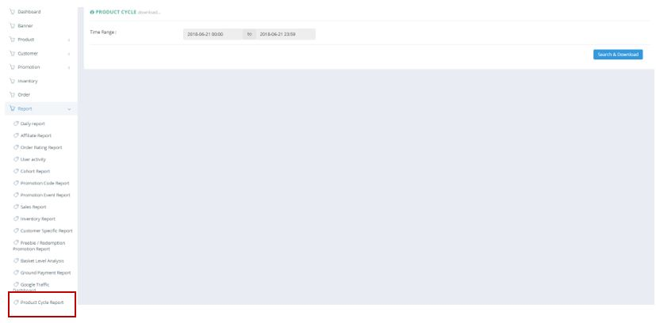
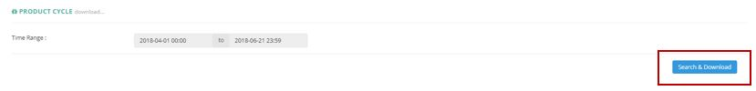

************
Product Cycle Report Module
************
User can Extract the Sales Value and Unit Detail of different Products from a specific Time Range defined by the User. 

|procy|

.. list-table:: Product Cycle Report Module
    :widths: 10 50
    :header-rows: 1
    :stub-columns: 1

    * - FIELD NAME
      - FIELD DESCRIPTIONS
    * - Time Range
      - The Date Range of Product Cycle Information to be Extracted
      
Product Cycle Report
==================
Users can click on the “Search & Download” button to Extract the Product Cycle Details.

|procy_report|

.. list-table:: Product Cycle Report
    :widths: 10 50
    :header-rows: 1
    :stub-columns: 1

    * - FIELD NAME
      - FIELD DESCRIPTIONS
    * - Category Name
      - The Product Category Name
    * - Brand Name
      - The Product Brand Name
    * - Product Name
      - The Name of Product
    * - Product SN
      - The Product ID
    * - Total Sale Value
      - The Total Sales Value of The Product
    * - Total Sale Unit
      - The Unit of Total Sales Value of The Product
    * - Total Order
      - The Amount of Total Order of The Product
    * - Sale value [Date]
      - The Date of The Sales Value
    * - Sale unit [Date]
      - The Date of The Sales Unit
    * - Order [Date]
      - The Date of The Order

