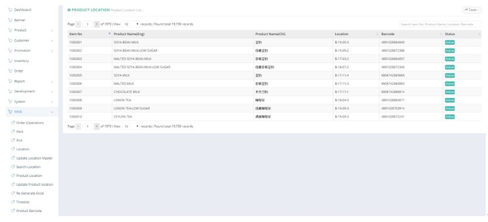
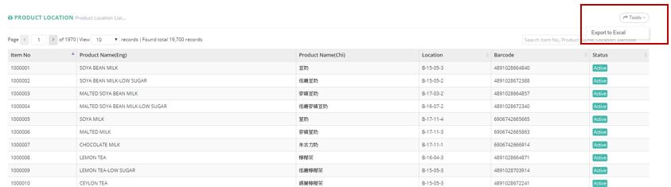

************
Product Location Module 
************
Product Location Module display the Location Details of different Products.

|prolocation|

.. list-table:: Product Location Module
    :widths: 10 50
    :header-rows: 1
    :stub-columns: 1

    * - FIELD NAME
      - FIELD DESCRIPTION
    * - Item No
      - The Product ID
    * - Product Name (Eng)
      - The Name of Product in English
    * - Product Name (Chi)
      - The Name of Product in Chinese
    * - Location
      - The Location of Product in Warehouse
    * - Barcode
      - The Barcode of Product
    * - Status
      - The Product Location Status
      
Location Master Report
==================
Users can Export Product Location Details by clicking on the “Tools” button and select “Export to Excel” option from the Dropdown List.

|prolocation_report|

.. list-table:: Location Master Report
    :widths: 10 50
    :header-rows: 1
    :stub-columns: 1

    * - FIELD NAME
      - FIELD DESCRIPTION
    * - Item No
      - The Product ID
    * - Barcode
      - The Product Barcode
    * - Location
      - The Product Location

