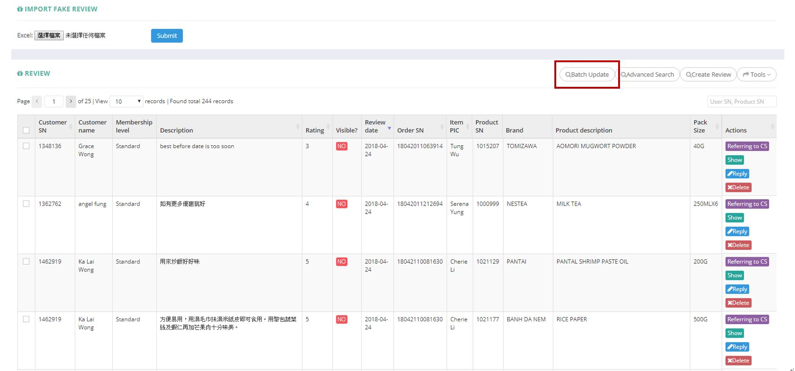
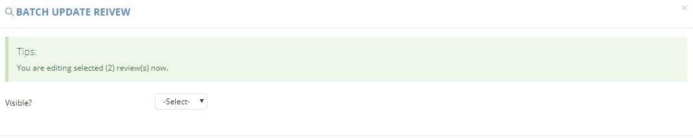
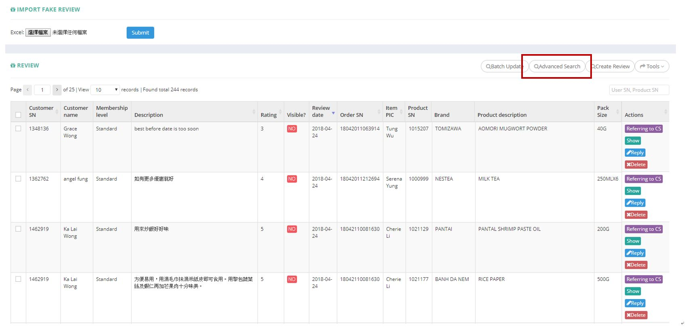
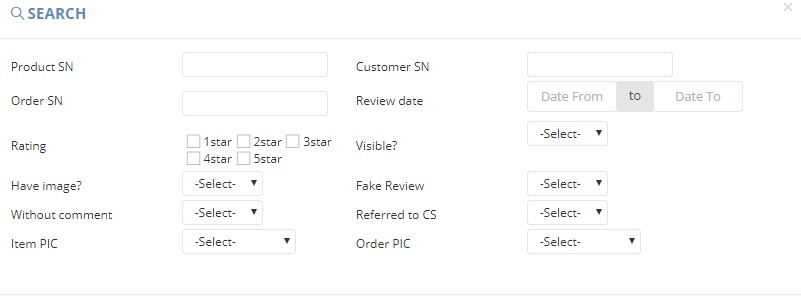
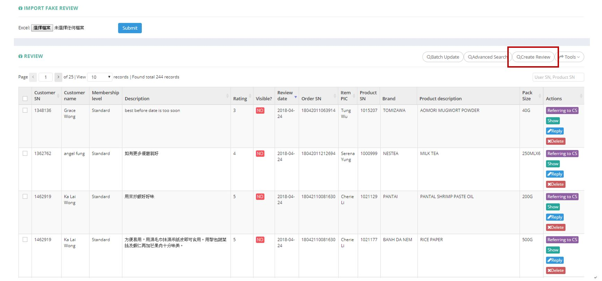
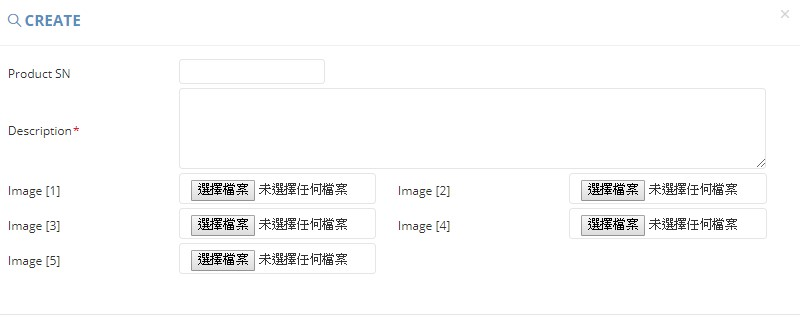
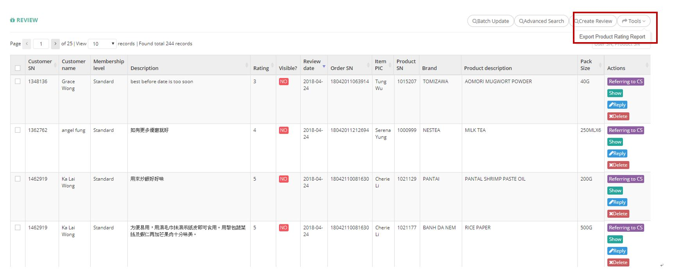

************
Product Rating Module 
************
Product Rating Module displays the review of different Product and Orders from the Customers. Users can search, update and create Customer Review. You can also export Review details in Excel format.

|Productratingmodule|

.. list-table:: Product Rating Module
    :widths: 10 50
    :header-rows: 1
    :stub-columns: 1

    * - FIELD NAME
      - FIELD DESCRIPTION
    * - Customer SN
      - The Customer ID
    * - Customer name
      - The Name of Customer
    * - Membership level
      - The Membership Level of Customer
    * - Description
      - The Description of Review
    * - Rating
      - The Rating Given by The Customer
    * - Visible?
      - "Yes" or "No" Visible Review
    * - Review Date
      - The Date of Customer Giving The Review
    * - Order SN
      - The Order Code
    * - Item PIC
      - The Person in Charge of The Product Item
    * - Product SN
      - The Product Code
    * - Brand
      - The Product Brand
    * - Product Description
      - The Product Description
    * - Pack Size
      - The Pack Size of Product Order
    * - Actions
      - Referring to CS - Refer The Customer Review to The CS Team, Show - Display The Review, Reply - Reply to The Review, Delete - Delete The Review Item

Batch Update
==================  
Users can update the visible status of more than one Customer Review at the same time by clicking on the “Batch Update” button on top of the Customer Review table while selecting the Customer reviews at the same time.

|Productratingbatchupdatebutton|
|Productratingbatchupdate|

.. list-table:: Product Rating Batch Update Page
    :widths: 10 50
    :header-rows: 1
    :stub-columns: 1

    * - FIELD NAME
      - FIELD DESCRIPTION
    * - Visible?
      - Whether the Customer Review will be visible to outside Customers

Advanced Search
================== 
Users can Search for Reviews with different criterion by clicking on the “Advanced Search” button on top of the Customer Review Table.

|Productratingadvancedsearchbutton|
|Productratingadvancedsearch|

.. list-table:: Product Rating Advanced Search Page
    :widths: 10 50
    :header-rows: 1
    :stub-columns: 1

    * - FIELD NAME
      - FIELD DESCRIPTION
    * - Product SN
      - The Product Code
    * - Customer SN
      - The Customer Code
    * - Order SN
      - The Order Code
    * - Review date
      - The Date Range of Customer Giving The Review
    * - Rating
      - The Rating Given by The Customer
    * - Visible?
      - "Yes" or "No" Visible Review
    * - Have image?
      - "Yes" or "No" Having Product Image?
    * - Fake Review
      - "Yes" or "No" Fake Review
    * - Without comment
      - The Date Range of Customer Giving The Review * - FIELD NAME
    * - Referred to CS
      - "Yes" or "No" Referred to CS
    * - Item PIC
      - The Person in Charge of The Product Item
    * - Order PIC
      - The Order Code.  The Person in Charge if The Product Order
      
Create Review
================== 
Users can Create new Review by clicking on the “Create Review” button on top of the Review table.

|Productratingcreatereviewbutton|
|Productratingcreatereview|

.. list-table:: Product Rating Create Review Page
    :widths: 10 50
    :header-rows: 1
    :stub-columns: 1

    * - FIELD NAME
      - FIELD DESCRIPTION
    * - Product SN
      - The Product Code
    * - Description
      - The Product Description
    * - Image [1]
      - Upload Product Review Image here
    * - Image [2]
      - Upload Product Review Image here
    * - Image [3]
      - Upload Product Review Image here
    * - Image [4]
      - Upload Product Review Image here
    * - Image [5]
      - Upload Product Review Image here
   
Product Rating Report
================== 
Users can export Customer Review details by clicking on the “Export Product Rating Report” option from the “Tools” button dropdown list.

|Productratingreport|

.. list-table:: Product Rating Report Column Headings
    :widths: 10 50
    :header-rows: 1
    :stub-columns: 1

    * - FIELD NAME
      - FIELD DESCRIPTION
    * - Customer SN
      - The Customer ID
    * - Customer Name
      - The Customer Name
    * - Membership Level
      - The Customer Member Level
    * - Description
      - The Customer Rating Content
    

.. |Productratingmodule| image:: Productratingmodule.JPG

