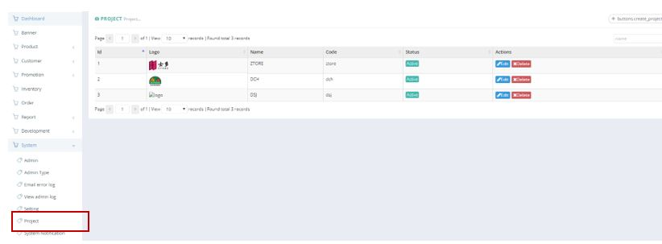
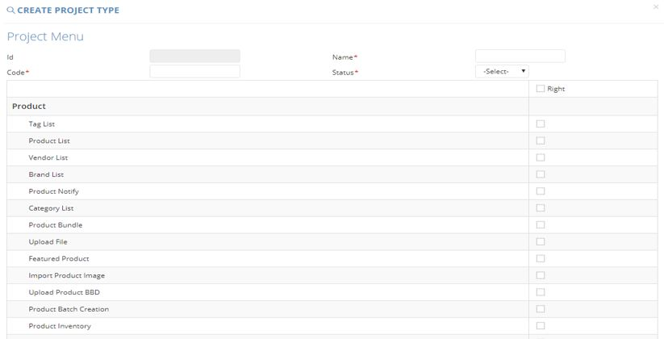

************
Project Module
************
Project Module display details of different Projects in Ztore.

|project|

.. list-table:: Project
    :widths: 10 50
    :header-rows: 1
    :stub-columns: 1

    * - FIELD NAME
      - FIELD DESCRIPTION
    * - ID
      - The Project ID
    * - Logo
      - The Project Logo
    * - Name
      - The Project Name
    * - Code
      - The Project Code
    * - Status
      - The Project Status
    * - Actions
      - Edit/ Delete Project
      
Create
==================

|project_create|

.. list-table:: Project Create
    :widths: 10 50
    :header-rows: 1
    :stub-columns: 1

    * - FIELD NAME
      - FIELD DESCRIPTION
    * - ID
      - The Project ID
    * - Name
      - The Project Name
    * - Code
      - The Project Code
    * - Status
      - The Project Status
    * - Project Product Selection
      - Select The Module for the Project

