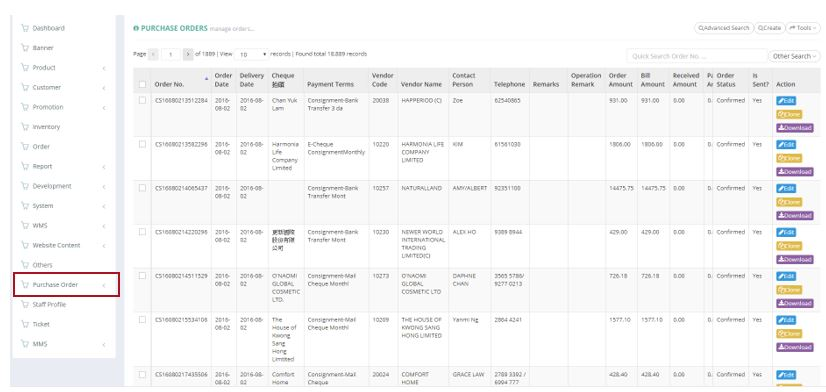
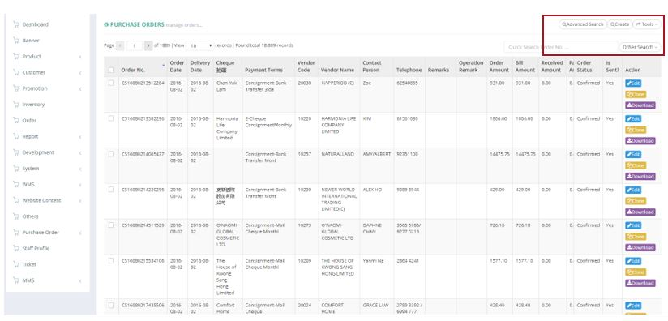
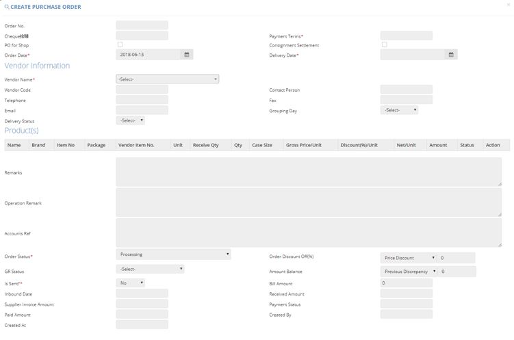
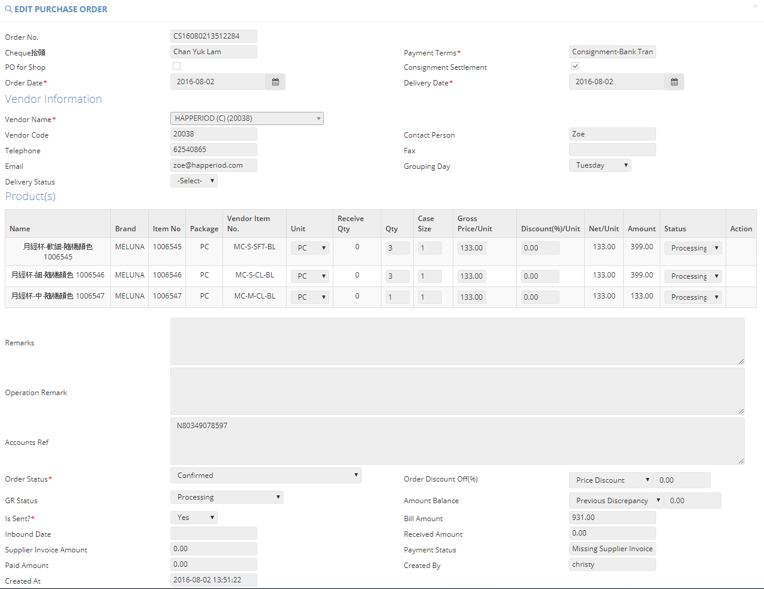
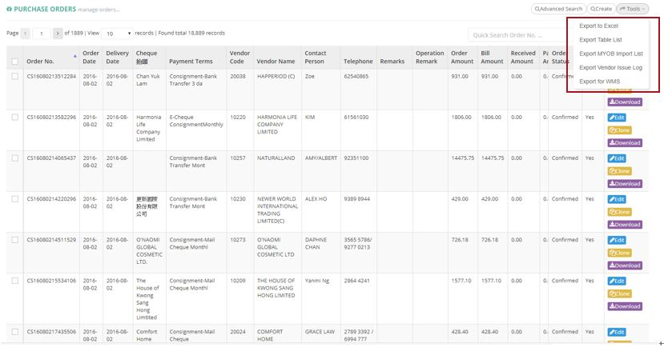

************
Purchase Order Module 
************
The Purchase Order displays the Purchase Orders made by our company to outside vendors. Users can use the “Advanced Search”, “Create” and “Tools” buttons to filter target orders, create purchase order items and export purchase order reports. With the buttons in the Action column users can also make changes or download the corresponding Order items.

|purorder|

.. list-table:: Purchase Order Module
    :widths: 10 50
    :header-rows: 1
    :stub-columns: 1

    * - FIELD NAME
      - FIELD DESCRIPTION
    * - Order No.
      - The Purchase Order ID
    * - Order Date
      - The Date of Purchase Order
    * - Delivery Date
      - The Date of Delivering the Purchase Order
    * - Cheque 抬頭
      - The Heading of Cheque settling the Order
    * - Payment Terms
      - The Payment Terms of Purchase Order
    * - Vendor Code
      - The Vendor Code of Purchase Order
    * - Vendor Name
      - The Vendor Name of Purchase Order
    * - Contact Person
      - The Contact Person of Vendor
    * - Telephone
      - The Telephone number of Vendor
    * - Remarks
      - The Additional Information of Purchase Order
    * - Operation Remark
      - The Additional Operation Information of Purchase Order
    * - Order Amount
      - The Order Amount of Purchase Order
    * - Bill Amount
      - The Bill Amount of Purchase Order
    * - Received Amount
      - The Received Amount of Purchase Order
    * - Paid Amount
      - The Paid Amount of Purchase Order
    * - Order Status
      - The Status of Order
    * - Is Sent?
      - "Yes" or "No" of whether the Order is sent
    * - Action
      - Edit, Clone or Download Purchase Order Item
      
Buttons
==================
The Buttons on top of The Table allow users to find The Target Purchase Order Items they are looking for, create new Purchase Order Items and export them out into a report.

|purorder_buttons|

.. list-table:: Purchase Order Module Buttons
    :widths: 10 50
    :header-rows: 1
    :stub-columns: 1

    * - FIELD NAME
      - FIELD DESCRIPTIONS
    * - Advanced Search
      - User can use multiple search criterion to locate the target Purchase Order item
    * - Create
      - User can create new Purchase Order Items.
    * - Tools
      - User can export different kinds of Purchase Order Reports.
    * - Other Search 
      - User can display all Purchase Orders or only all paid orders in the table
    * - Order No Input Box
      - User can input corresponding Purchase Order ID to locate Purchase Order
      
Advanced Search
==================
Users can input different criterion into the pop-up Advanced Search window to locate target Purchase Order Items.

|purorder_search|

.. list-table:: Purchase Order Module Advanced Search
    :widths: 10 50 50
    :header-rows: 1
    :stub-columns: 1

    * - FIELD NAME
      - FIELD DESCRIPTIONS
      - CALCULATION/ DROPDOWN LIST
    * - Order Date
      - The Date Range of Purchase Order
      -
    * - Delivery Date
      - The Date Range of Delivering the Purchase Order
      -
    * - Inbound Date
      - The Date Range of Inbounding the Purchase Order
      -
    * - Vendor Name 
      - The Vendor Name of Purchase Order
      -
    * - Payment Terms
      - The Payment Terms of Purchase Order
      -
    * - PO for Shop
      - Select if there is PO for Shop
      -
    * - Consignment Settlement
      - Select if there is Consignment Settlement
      -
    * - Exist Operation Remark?
      - Select if there is Existing Operation Remark
      -
    * - Created By
      - The Person who Created The Purchase Order
      -
    * - Is Sent?
      - Whether The Order is Sent
      -
    * - Order Status
      - The Order Status of The Purchase Order
      - - Processing - The Purchase Order is cuurently under process
        - Submitted to Account - The Purchase Order is submitted to Account Department
        - Confirmed - The Purchase Order is confirmed by The Vendor
        - Paid & Unreceived - The Purchase Order is Paid but not yet Received
        - Received & Unpaid - The Purchase Order is Unpaid but already Received
        - Received & Unpaid & Variance - The Purchase Order is Unpaid and Received but Variance Exist with Received Quantities and Ordered Quantities
        - Received & Paid & Variance -  The Purchase Order is Paid and Received but Variance Exist with Received Quantities and Ordered Quantities
        - Received & Paid & Merchandising Settled Variance - The Purchase Order is Paid and Received but Settled Variance Exist with Received Quantities and Ordered Quantities
        - Closed - The Purchase Order is completed
        - Void - The Purchase Order is Voided
    * - GR Status
      - Good Receive Status, use for workflow control
      - - Processing - The Purchase Order is currently under process
        - Confirmed - The Purchase Order is confirmed by The Vendor
        - Arrived - The Purchase Order has arrived the warehouse
        - Received - The Purchase Order is received by our staff
        - Received with Qty Variance - The Purchase Order is received and being confirmed on the quantity
        - Partial Received - The Purchase Order is only partially received by our staff
    * - Order No(s)
      - The Order No.(s) of Orders to be Searched, 1 row 1 order no.
      - 

Create and Edit
==================
By clicking the “Create” Button on top of the Purchase Order table, users can create a new Purchase Order Item.
Users can also click the “Edit” Button of the corresponding Purchase Order Item under the Action column to edit the details of that item.

|purorder_create|

|purorder_edit|

.. list-table:: Create and Edit Purchase Order Items
    :widths: 10 50 50
    :header-rows: 1
    :stub-columns: 1

    * - FIELD NAME
      - FIELD DESCRIPTION
      - CALCULATION/ DROPDOWN LIST
    * - Order No.
      - The Purchase Order ID
      -
    * - Cheque 抬頭
      - The Heading of Cheque settling the Order
      -
    * - Payment Terms
      - The Payment Terms of Purchase Order
      -
    * - PO for Shop
      - Select if there is PO for Shop
      -
    * - Consignment Settlement
      - Select if there is Consignment Settlement
      -
    * - Order Date
      - The Date of Making The Purchase Order
      -
    * - Delivery Date
      - The Date of Purchase Order Delivery
      -
    * - Vendor Name
      - The Name of Vendor in The Purchase Order
      -
    * - Vendor Code
      - The Code of Vendor in The Purchase Order
      -
    * - Contact Person
      - The Contact Person of The Vendor
      -
    * - Telephone
      - The Telephone Contact of The Vendor
      -
    * - Fax
      - The Fax of The Vendor
      -
    * - Email
      - The Email of The Vendor
      -
    * - Grouping Day
      - The day vendor delivered goods to warehouse
      -
    * - Delivery Status
      - The Delivery Status of The Vendor
      -
    * - Remarks
      - The Remarks of Product in The Purchase Order
      -
    * - Operation Remark
      - The Operation Remarks of Product in The Purchase Order
      -
    * - Accounts Ref
      - The Account Reference of Product in The Purchase Order
      -
    * - Order Status
      - The Order Status of The Purchase Order
      - - Processing -
        - Submitted to Account -
        - Confirmed -
        - Paid & Unreceived -
        - Received & Unpaid -
        - Received & Unpaid & Variance -
        - Received & Paid & Variance -
        - Received & Paid & Merchandising Settled Variance -
        - Closed -
        - Void -
    * - Order Discount Off(%)
      - The Discount of The Purchase Order
      -
    * - GR Status
      - 
      - - Processing -
        - Confirmed -
        - rived -**
        - Received -
        - Received with Qty Variance -
        - Partial Received -
         
    * - Amount Balance
      - There are two type of amount balance. The first one is "Previous Discrepancy", it affects "Bill Amount" but not "Product WAC". Another one is "Promotion Credits", it affects both "Bill Amount" and "Product WAC".
      - When balance type = Previous Discrepancy, bill amount = sum of product amount + balance amount; When balance type = Promotion Credits, bill amount = sum of product amount - balance amount
    * - Is Sent?
      - Select if The Purchase Order is sent
      - 
    * - Bill Amount
      - The Billing Amount of The Purchase Order
      -
    * - Inbound Date
      - The Inbounding Date of Products of The Purchase Order
      -
    * - Received Amount
      - The Received Amount of Products of The Purchase Order
      -
    * - Supplier Invoice Amount
      - The amount in supplier invoice, use to check is it same with bill amount
      -
    * - Payment Status
      - The Payment Status of The Purchase Order
      -
    * - Paid Amount
      - The Paid Amount of The Purchase Order
      -
    * - Created By
      - The Person created The Purchase Order
      -
    * - Created At
      - The Date of Creating The Purchase Order
      -
      
Purchase Order Report
==================
Users can export Purchase Order Reports from the system by clicking on the “Tools” Button on top of the order list table, then select the type of report to be exported.

|purorder_report|

Purchase Order Report Headings
------------------
Purchase Order Report shows the detailed information of the selected order items exported in Excel File format.
The table below lists out the headings users are going to see in the order reports with brief descriptions attached.

Inbound List Report
------------------
Users can select “Export to Excel” from the dropdown list of the “Tools” button, it displays the details of how different Purchase Orders Items move into our warehouse.

.. list-table:: Inbound List Report
    :widths: 10 50
    :header-rows: 1
    :stub-columns: 1

    * - FIELD NAME
      - FIELD DESCRIPTIONS
    * - ERP單號（採購訂單號）
      - The Purchase Order ID
    * - 入庫類型
      - The Purchase Order Type
    * - 供應商編號
      - The Vendor Code
    * - 貨品編號
      - The Product ID
    * - 入庫數量
      - The Inbound Product Quantity
    * - 預計收貨時間
      - The Estimated Receiving Date of Purchase Order
      
Purchase Order Report
------------------
Users can select “Export Table List” from the dropdown list of the “Tools” button, it displays the details of different Purchase Orders.

.. list-table:: Purchase Order Report
    :widths: 10 50
    :header-rows: 1
    :stub-columns: 1

    * - FIELD NAME
      - FIELD DESCRIPTION
    * - Order No.
      - The Purchase Order ID
    * - Order Date
      - The Date of Purchase Order
    * - Delivery Date
      - The Date or Purchase Order Delivery
    * - Cheque抬頭
      - The Heading of The Cheque
    * - Payment Terms
      - The Payment Terms of Purchase Order
    * - Vendor Code
      - The Vendor ID
    * - Vendor Name
      - The Vendor Name
    * - Contact Person
      - The Contact Person of Vendor
    * - Telephone
      - The Telephone number of Vendor
    * - Remarks
      - The Additional Information of Purchase Order
    * - Operation Remark
      - The Additional Operation Information of Purchase Order
    * - Order Amount
      - The Order Amount of Purchase Order
    * - Bill Amount
      - The Bill Amount of Purchase Order
    * - Received Amount
      - The Received Amount of Purchase Order
    * - Paid Amount
      - The Paid Amount of Purchase Order
    * - Supplier Invoice Amount
      - The Invoice Amount of Supplier for The Purchase Order
    * - Inbound date
      - The Purchase Order Inbound Date
    * - Status
      - The Purchase Order Status
    * - Sent To YF?
      - need to send to warehouse (YF)
    * - Account Ref
      -
    * - Created By
      - The Person Created The Purchase Order
      
MYOB Purchase Order Report
------------------
Users can select “Export MYOB Import List” from the dropdown list of the “Tools” button, it displays ______________________________ .

.. list-table:: MYOB Purchase Order Report
    :widths: 10 50
    :header-rows: 1
    :stub-columns: 1

    * - FIELD NAME
      - FIELD DESCRIPTIONS
    * - Addr 1 - Line 1
      - The First Line of Address (Company Name)
    * - Purchase #
      - The Purchase Order ID
    * - Date
      - The Date of Purchase Order
    * - Supplier Invoice #
      - The Supplier Invoice ID
    * - Delivery Status
      -
    * - Account #
      -
    * - Amount
      -
    * - Inc-Tax Amount
      -
    * - Journal Memo
      -
    * - Non-Tax Amount
      -
    * - Import Duty Amount
      -
    * - Freight Non-Tax Amount
      -
    * - Freight Import Duty Amount
      -
    * - Purchase Status
      - 
    * - Currency Code
      - The Sales Currency of The Purchase Order
    * - Exchange Rate
      - The Exchange Rate of Currency to HKD
    * - Terms - Payment is Due
      -
    * - - Discount Days
      -
    * - - Balance Due Days
      -
    * - - % Discount
      -
    * - Amount Paid
      -
    * - Card ID
      -
    * - Record ID
      -
    * - Promotion Credits
      -
      
Vendor Issue Log Report
------------------
Users can select “Export Vendor Issue Log” from the dropdown list of the “Tools” button, it displays the details of different Purchase Orders.

.. list-table:: Vendor Issue Log Report
    :widths: 10 50
    :header-rows: 1
    :stub-columns: 1

    * - FIELD NAME
      - FIELD DESCRIPTIONS
    * - Inbound date
      - The Inbound Date of Purchase Order
    * - Order No.
      - The Purchase Order Number
    * - Delivery Date
      - The Date of Purchase Order Delivery
    * - Item Code / Barcode
      - The Product ID/Barcode in The Purchase Order
    * - Payment Terms
      - The Payment Terms of Purchase Order
    * - Vendor Code
      - The Vendor ID
    * - Vendor Name
      - The Vendor Name
    * - Created by
      - The Person Created The Purchase Order
    * - Remarks
      - The Additional Information of Purchase Order
    * - Operation Remark
      - The Additional Operation Information of Purchase Order
    * - Account Ref
      -
    * - Order Amount
      - The Order Amount of The Purchase Order
    * - Bill Amount
      - The Billing Amount of Purchase Order
    * - Received Amount
      - The Received Amount of Purchase Order
    * - Paid Amount
      - The Paid Amount of Purchase Order
    * - Status
      - 
    * - Issue Type
      -
    * - Qty (units)
      - The Quantity of Product Ordered in The Purchase Order
    * - Merchant Comment
      -
    * - New PO No. for action
      -
    * - Change GR status to settled
      -
      
Inbound List for WMS
------------------
Users can select “Export for WMS” from the dropdown list of the “Tools” button, it displays the details of different Purchase Orders for WMS.

.. list-table:: Inbound List for WMS
    :widths: 10 50
    :header-rows: 1
    :stub-columns: 1

    * - FIELD NAME
      - FIELD DESCRIPTIONS
    * - Inbound Order SN
      - The Inbound Purchase Order ID
    * - Inbound Type
      - The Type of Purchase Order
    * - Vendor Name
      - The Vendor Name
    * - Item No
      - The Product ID of Products in The Purchase Order
    * - Qty
      - The Quantity of The Product in The Purchase Order
    * - Order Date
      - The Date of Creating The Order
    * - Delivery Date
      - The Date of Purchase Order Delivery
    * - Payment Terms
      - The Purchase Order Terms of Payment
    * - Order Amount
      - The Total Order Amount of The Purchase Order
    * - Case Size
      - The Size of Purchase Order Case

