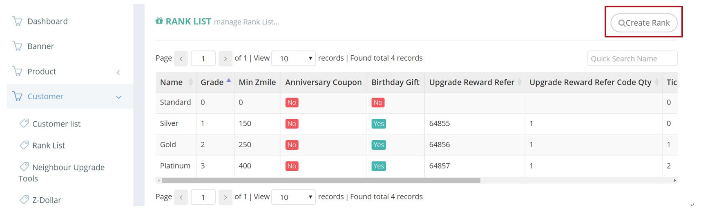

************
Rank List Module 
************
Rank List shows the details of different Customer Tiers.

|ranklist|

.. list-table:: Rank List Module
    :widths: 10 50
    :header-rows: 1
    :stub-columns: 1

    * - FIELD NAME
      - FIELD DESCRIPTION
    * - Name
      - The Name of Rank
    * - Grade
      - The Grade of Rank
    * - Min Zmile
      - The minimum requirement of Zmile for the Rank
    * - Anniversary Coupon
      - "Yes" or "No" Anniversary Coupon
    * - Birthday Gift
      - "Yes" or "No" Birthday Gift
    * - Upgrade Reward Refer
      - Ref a selected promo code id, system will copy the ref code as new for the user
    * - Upgrade Reward Refer Code Qty
      - How many codes will give "Upgrade Reward Refer" generated codes to the user?
    * - Ticket Redeem Quota
      - The Upper Limit of Ticket this Rank can Redeem
    * - Code Redeem Quota
      - The Upper Limit of Code this Rank can Redeem
    * - Product Redeem Quota
      - The Upper Limit of Product this Rank can Redeem
    * - Actions
      - Edit - Edit Rank Item Information
      

      
Create and Edit Rank
==================
Users can create a new Customer Rank by clicking on the “Create Rank” button on top of the Rank List Table and enter the details of new Rank.

|Rankcreaterankbutton|
|ranklist_edit|

Users can edit details of a Customer Rank by clicking the corresponding “Edit” button in the “Actions” column.

|ranklist_edit2|

.. list-table:: Rank List Module Create and Edit
    :widths: 10 50 50
    :header-rows: 1
    :stub-columns: 1

    * - FIELD NAME
      - FIELD DESCRIPTIONS
      -
    * - ID
      - The Rank ID
      -
    * - Code
      - The Rank Code
      -
    * - Grade
      - The Rank Grade
      -
    * - EN Name
      - The English Rank Name
      -
    * - TC Name
      - The Traditional Chinese Rank Name
      -
    * - Min Zmile
      - The Minimum Zmile to Obtain The Rank
      -
    * - Anniversary Coupon
      - Coupon = Promotion Code
        Like "Reward Refer Code"
      - Now is stopped 
        System will give the promo code to the user when date = (first day of valid order + 1year)
    * - Birthday Gift
      - Gift = Promotion Code
        Like ""Reward Refer Code""
      - System will give the promo code when the first day of the customer birthday month
    * - Upgrade Reward Refer
      - Ref a selected promo code id, system will copy the ref code as new for the user
      -
    * - Upgrade Reward Refer Code Only
      - How many codes will give "Upgrade Reward Refer" generated codes to the user?
      - 
    * - Ticket Redeem Quota
      - The Upper Limit of Ticket Redeem for The Rank
      -
    * - Code Redeem Quota
      - The Upper Limit of Code Redeem for The Rank
      -
    * - Product Redeem Quota
      - The Upper Limit of Product Redeem for The Rank
      -

