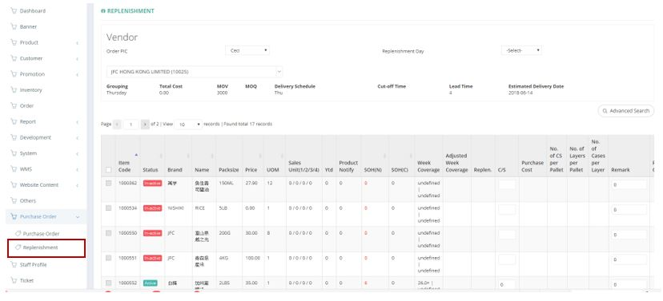

************
Replenishment Module
************
Users can input different Purchase Order in this session for forecasting and planning, the replenishment items can easily be converted into Purchase Order by clicking the “Convert to PO” button at the bottom of the page.

|replen|

.. list-table:: Replenishment Module
    :widths: 10 50 50
    :header-rows: 1
    :stub-columns: 1

    * - FIELD NAME
      - FIELD DESCRIPTIONS
      - CALCULATION
    * - Order PIC
      - The Person In Charge for The Replenishment Order
      -
    * - Replenishment Day
      - The Weekday of Replenishment occur
      -
    * - Item Code
      - The Code of Replenished Item
      -
    * - Status
      -
      -
    * - Brand 
      - The Brand of Replenished Item
      -
    * - Name
      - The Name of Replenished Item
      -
    * - Packsize
      - The Pack size of Replenished Item
      -
    * - Price
      - The Price of Replenished Item
      -
    * - UOM
      - The quantity of 1 set
      -
    * - Sales Unit (1/2/3/4)
      - The Sales Unit of the Item
      -
    * - Ytd
      - Sales unit from 1 Jan of this year and it includes sales unit from bundle
      -
    * - Product Notify
      - Number of Product Notify which records from last inbound
      -
    * - SOH(N)
      - The fields state the normal stock on hand. Normal stock means that the best before date deducts min shelf day and deducts 10 days (for delivery process) is after today
      -
    * - SOH(C)
      - The fields state the clearance stock on hand. Clearance stock means that the best before date between today plus 10 days (for delivery process) and today plus 10 days (for delivery process) plus min shelf day.
      -
    * - Week Coverage
      - Week Coverage is the estimated time for selling all inventory at this moment for this product.
        There are two method to estimate the time. One control by recent 2 week sales record, another one is affected by past year data such as inventory, sales unit, replenish frequency and etc. 
      - The right one-week coverage = SOH(N) / the average week coverage of recent 2 week.
        The left one which updates daily by replenishment module
    * - Adjusted Week Coverage
      - Week Coverage after replenishment
      - Use the same logic of week coverage, but replace SOH(N) by SOH(N) + Replen.\
    * - Replen.
      - The number of qty ready to order
      - C/S * UOM
    * - C/S
      - The number of set ready to order, system will preset an estimated number in this field
      -
    * - Purchase Cost
      - The purchase amount for this item line
      - C/S * cost per set
    * - No. of CS per Pallet
      - Number of case size for each pallet
      -
    * - No. of Layers per Pallet
      - Number of layer for each pallet
      -
    * - No. of Cases per Layer
      - Number of case size for each layer
      -
    * - Remarks
      - The Remarks of The Replenishment Order
      -
    * - Previous Order
      - The Date of Previous Product Replenishment Order
      -
    * - Arrival Date
      - The Arrival Date of Replenishment Order
      -

