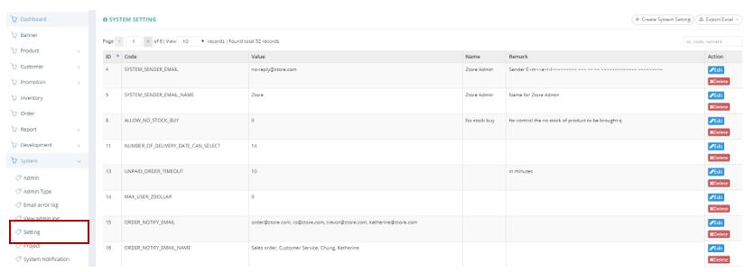
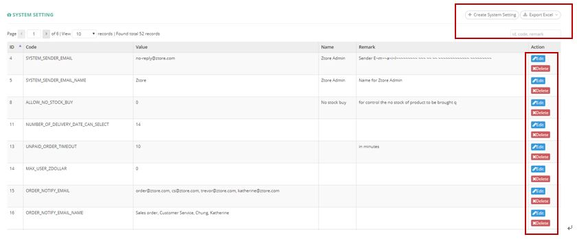
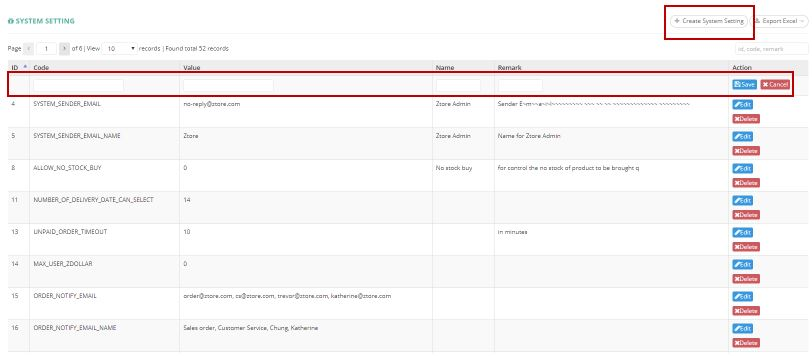
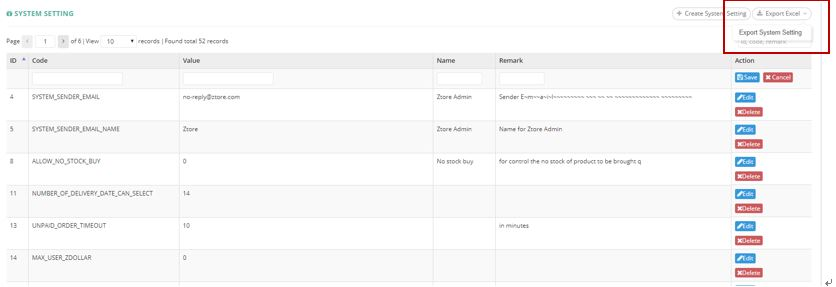

************
Setting Module
************
Setting Module displays the System Setting made. Users can Create new System Setting or Export System Setting Details in Excel Format. Users can Edit or Delete System Setting Items by clicking on the corresponding in the “Action” column.

|setting|

.. list-table:: Setting Module
    :widths: 10 50
    :header-rows: 1
    :stub-columns: 1

    * - FIELD NAME
      - FIELD DESCRIPTIONS
    * - ID
      - The Setting ID
    * - Code
      - The Code of Setting
    * - Value
      - The Value of Setting
    * - Name
      - The Name of Setting
    * - Remark
      - The Remark of Setting
    * - Action
      - Edit/ Delete System Setting
      
Button
==================
Users can Create System Setting and Export System Setting Details by clicking on the buttons on top of System Setting table. You can also carry out quick search by inputting System Setting into the Input Box on top of the System Setting table. Edit and Delete System Setting can be done by clicking on the corresponding buttons in the “Acion” column.

|setting_buttons|

.. list-table:: Setting Module Buttons
    :widths: 10 50
    :header-rows: 1
    :stub-columns: 1

    * - FIELD NAME
      - FIELD DESCRIPTIONS
    * - Create System Setting
      - User can Create new System Setting and input System Setting Details into the Popup Window
    * - Export Excel
      - User can Export System Setting Detail in Excel Format
    * - ID, code, remark
      - User can carry out quick search by inputting System Setting Details into the Input Box
    * - Edit
      - Edit System Setting Item Details
    * - Delete
      - Delete System Setting Item
      
Create
==================
Users can Create New System Setting by clicking on the “Create System Setting” button and input System Setting Details into the popup window.

|setting_create|

.. list-table:: Setting Module Create
    :widths: 10 50
    :header-rows: 1
    :stub-columns: 1

    * - FIELD NAME
      - FIELD DESCRIPTIONS
    * - Code
      - The Code of Setting
    * - Value
      - The Value of Setting
    * - Name
      - The Name of Setting
    * - Remark
      - The Remark of Setting
    * - Action
      - Save/Cancel of Admin Setting
      
System Setting Report
==================
Users can export System Setting details by clicking on the “Export System Setting” Option from the “Export Excel” button on top of the System Setting Table.

|setting_report|

.. list-table:: System Setting Report
    :widths: 10 50
    :header-rows: 1
    :stub-columns: 1

    * - FIELD NAME
      - FIELD DESCRIPTIONS
    * - ID
      - The System Setting ID
    * - Code
      - The System Setting Code
    * - Value
      - The System Setting Value
    * - Name
      - The System Setting Name
    * - Remark
      - The Additional Information of System Setting Item

