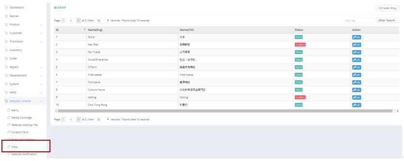
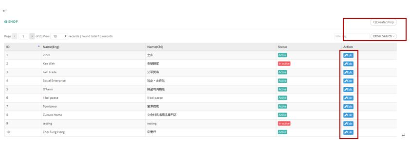
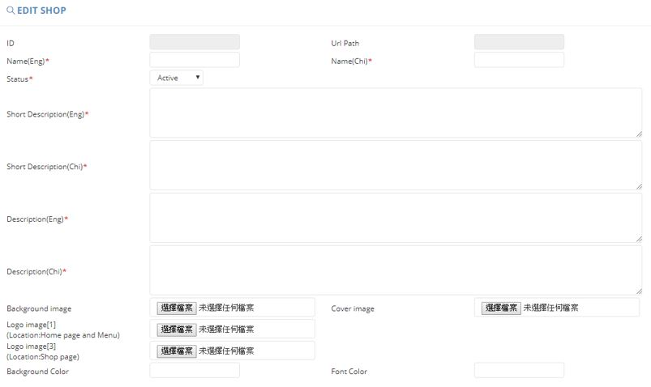
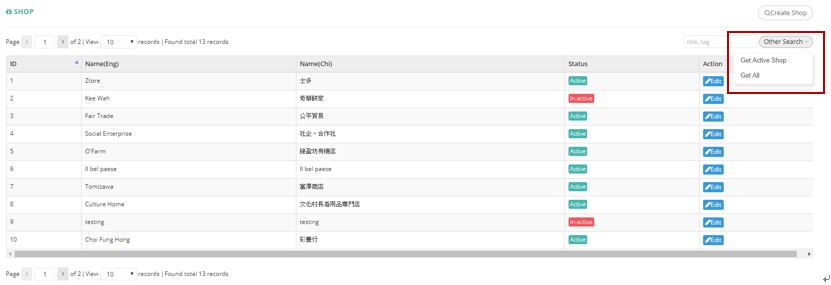

************
Shop Module
************
Shop Module displays the details of Shops listed on Ztore.

|shop|

.. list-table:: Shop Module
    :widths: 10 50
    :header-rows: 1
    :stub-columns: 1

    * - FIELD NAME
      - FIELD DESCRIPTIONS
    * - ID
      - The Shop ID
    * - Name (Eng)
      - The English Shop Name
    * - Name (Chi)
      - The Chinese Shop Name
    * - Status
      - Active/ Inactive Shop
    * - Actions
      - Edit Shop Item
      
Buttons
==================
Users can Create and Search Shop Items by clicking on the buttons on top of the Shop Table. You can also Edit Existing Shop Items Details by clicking on corresponding buttons in the “Action” column.

|shop_buttons|

.. list-table:: Shop Module Buttons
    :widths: 10 50
    :header-rows: 1
    :stub-columns: 1

    * - BUTTONS
      - DESCRIPTIONS
    * - Create Shop
      - User can create new shop item by inputting details into the popup window
    * - Title, Tag Input Box
      - User can quick search by inputting Shop Item Details
    * - Other Search
      - User can filter Shop Item by their Status
    * - Edit
      - Edit Existing Shop Items Details
      
Create
==================
Users can click on the “Create Shop” button on top of Shop Table and input Shop Details into the popup window.

|shop_create|

.. list-table:: Create Shop
    :widths: 10 50
    :header-rows: 1
    :stub-columns: 1

    * - FIELD NAME
      - FIELD DESCRIPTIONS
    * - ID
      - The Shop ID
    * - URL Path
      - The Shop Link
    * - Name(Eng)
      - The English Shop Name
    * - Name(Chi)
      - The Chinese Shop Name
    * - Status
      - Active/ Inactive Shop
    * - Short Description(Eng)
      - The English Short Description of The Shop
    * - Short Description(Chi)
      - The Chinese Short Description of The Shop
    * - Description(Eng)
      - The English Description of The Shop
    * - Description(Chi)
      - The Chinese Description of The Shop
    * - Background Image
      - Upload The Background Image of The Shop here
    * - Cover Image
      - Upload The Cover Image of The Shop here
    * - Logo Image[1](Location:Home page and Menu)
      - Upload The Shop Logo Image in Home Page and Menu here
    * - Logo Image[3](Location:Shop page)
      - Upload The Shop Logo Image in Shop Page here
    * - Background Color
      - The Background Color of The Shop
    * - Font Color
      - The Font Color of The Shop
      
Other Search
==================
Users can filter the Shop Items by their status when clicking on the “Other Search” button on top of the Shop Table.

|shop_search|

.. list-table:: Shop Module Other Search
    :widths: 10 50
    :header-rows: 1
    :stub-columns: 1

    * - FIELD NAME
      - FIELD DESCRIPTIONS
    * - Get Active Shop
      - Display Shops with “Active” Status
    * - Get All
      - Display All Shops

