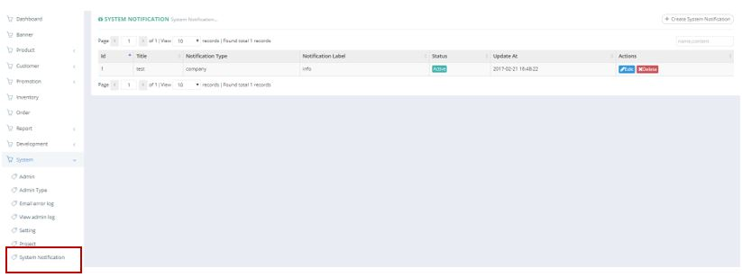
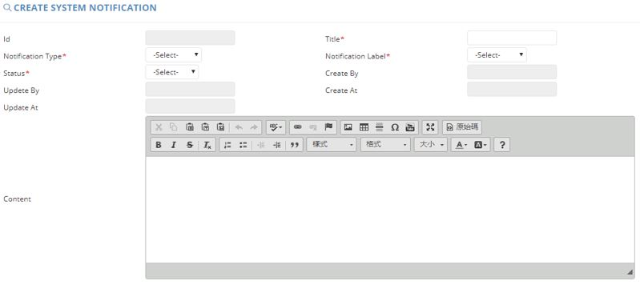

************
System Notification Module
************
System Notification Module displays the details of system notifications.

|systemnoti|

.. list-table:: System Notification
    :widths: 10 50
    :header-rows: 1
    :stub-columns: 1

    * - FIELD NAME
      - FIELD DESCRIPTIONS
    * - ID
      - The System Notification ID
    * - Title
      - The System Notification Title
    * - Notification Type
      - The Type of System Notification
    * - Notification Level
      - The Notification Level of System Notification
    * - Status
      - Active/ Inactive System Notification
    * - Update At
      - The Latest Update Date of System Notification
    * - Actions
      - Edit/ Delete System Notification

Create
==================
Users can Create new System Notification by clicking on the “Create System Notification” button on top of the System Notification table and input New System Notification details into the popup window.

|systemnoti_create|

.. list-table:: Create System Notification
    :widths: 10 50
    :header-rows: 1
    :stub-columns: 1

    * - FIELD NAME
      - FIELD DESCRIPTIONS
    * - ID
      - The System Notification ID
    * - Title
      - The System Notification Title
    * - Notification Type
      - The Type of System Notification
    * - Notification Label
      - The Notification Label of System Notification
    * - Status
      - Active/ Inactive System Notification
    * - Create By
      - The Person who create The System Notification
    * - Update By
      - The Latest Update Person of The System Notification
    * - Create At
      - The Date of creating The System Notification
    * - Update At
      - The Latest Update Date of The System Notification
    * - Content
      - The Content of System Notification

