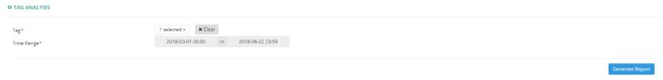
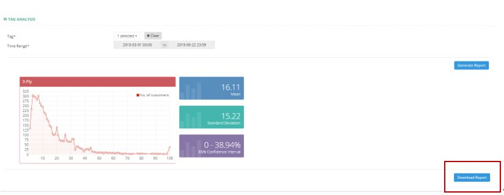

************
Tag Analysis Module
************
Tag Analysis Module display the Tag Data and Statistics of Products purchased by different Customers in this Module.

|tag|

.. list-table:: Tag Analysis Module
    :widths: 10 50
    :header-rows: 1
    :stub-columns: 1

    * - FIELD NAME
      - FIELD DESCRIPTIONS
    * - Tag
      - Select The Tags to be Extracted
    * - Time Range
      - The Date Range of Tag Information to be Extracted
      
Tag Analysis Report
==================
Users can Export Tag Analysis Data in Excel Format by clicking on the “Download Report” button.

|tag_report|

.. list-table:: Tag Analysis Report
    :widths: 10 50
    :header-rows: 1
    :stub-columns: 1

    * - FIELD NAME
      - FIELD DESCRIPTIONS
    * - SN
      - The Customer ID
    * - Email
      - The Customer Email
    * - Mobile no
      - The Customer Mobile Number
    * - Total Tag
      - The Total Number of Tags involved in The Products purchased by The Customer
    * - 1st Tag
      - The Name of first Tag
    * - 1st %
      - The Proportion of first Tag in All The Tags
    * - 2nd Tag
      - The Name of second Tag
    * - 2nd %
      - The Proportion of second Tag in All The Tags
    * - 3rd Tag
      - The Name of third Tag
    * - 3rd %
      - The Proportion of third Tag in All The Tags

