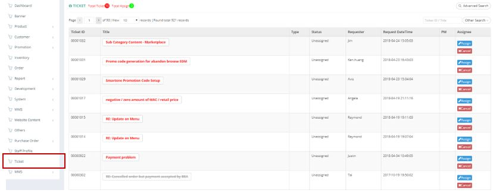
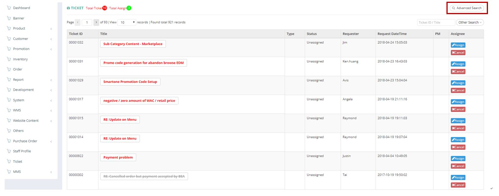
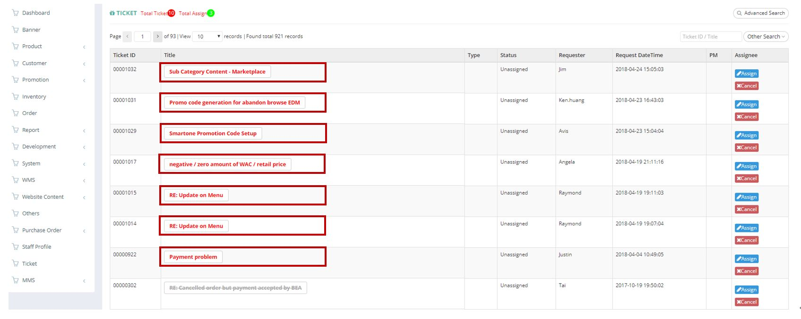
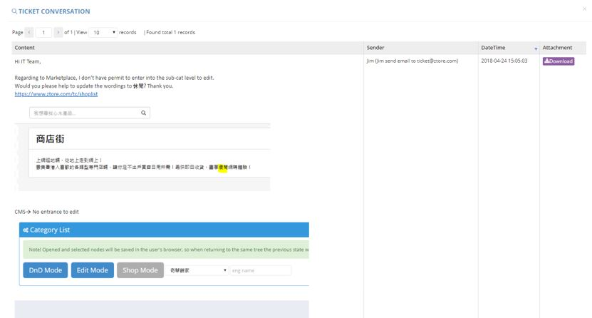
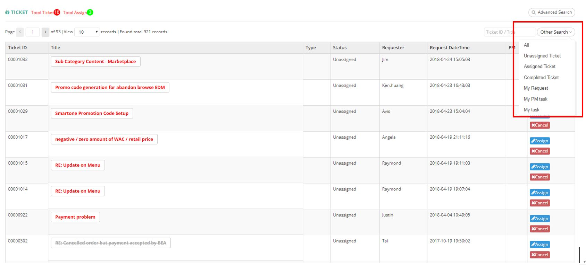
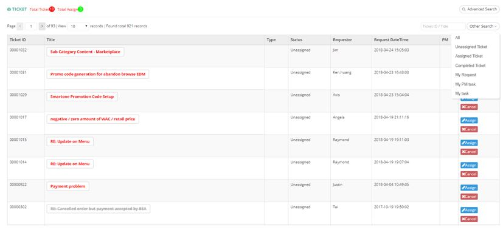

************
Ticket Module 
************
Ticket Module displays the Ticket Details and Status to the Users.

|ticket|

.. list-table:: Ticket Module
    :widths: 10 50
    :header-rows: 1
    :stub-columns: 1

    * - FIELD NAME
      - FIELD DESCRIPTION
    * - Ticket ID
      - The Ticket ID
    * - Title
      - The Title of Ticket
    * - Type
      - The Ticket Type: Promotion/Problem Report/Report Request/Develop Request/CMS/DB Update/Other
    * - Status
      - "Assigned"/ "Unassigned" Ticket Item
    * - Requester
      - The Requester of Ticket
    * - Request DateTime
      - The Date and Time of The Ticket requested
    * - Assignee
      - Assign or Cancel Ticket Item
      
Advanced Search
==================
Users can Search for Tickets by clicking on the “Advanced Search” button on top of the Ticket Table and input search criterion into the popup window.

|Ticketmoduleadvancedsearchbutton|
|ticket_search|

.. list-table:: Ticket Module Advanced Search
    :widths: 10 50
    :header-rows: 1
    :stub-columns: 1

    * - FIELD NAME
      - FIELD DESCRIPTIONS
    * - Title
      - The Ticket Title
    * - Sender Email
      - The Email of Ticket Sender
    * - Ticket Type
      - The Ticket Type
    * - Create Date
      - The Date Range of Creating The Ticket
    * - Assignee
      - The Assignee of The Ticket
    * - Status
      - - Unassigned
        - Assigned
        - Complete
        - Cancel 

Ticket Conversation
==================
Users can click on the Title of Ticket to see the Ticket details on a popup window.

|Ticketconversationbutton|
|ticket_conver|

.. list-table:: Ticket Conversation
    :widths: 10 50
    :header-rows: 1
    :stub-columns: 1

    * - FIELD NAME
      - FIELD DESCRIPTIONS
    * - Content
      - The Ticket Content
    * - Sender
      - The Ticket Sender
    * - DateTime
      - The Date and Time of Sending out The Ticket
    * - Attachment
      - The Related Attachments with The Ticket
      
Other Search
==================
Users can filter Tickets easily by clicking on the “Other Search” button on top of the Ticket by Ticket Status and Assignee.

|Ticketothersearchbutton|
|ticket_othersearch|

.. list-table:: Ticket Other Search
    :widths: 10 50
    :header-rows: 1
    :stub-columns: 1

    * - FIELD NAME
      - FIELD DESCRIPTIONS
    * - All
      - Show All Ticket
    * - Unassigned Ticket
      - Show Tickets with "Unassigned" Status
    * - Assigned Ticket
      - Show Tickets with "Assigned" Status
    * - Completed Ticket
      - Show Tickets with "Completed" Status
    * - My Request
      - Show My Own Requests
    * - My PM task
      - Show Tickets from your PM
    * - My task
      - Show Tickets Belong to Me
      
      

.. |ticket_search| image:: ticket_search.JPG

