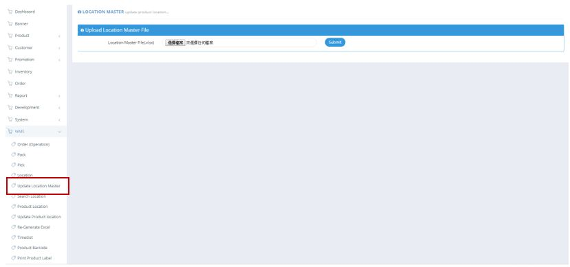

************
Update Location Master Module
************
User can upload a location master file.

|location_update|

.. list-table:: Update Location Master Module
    :widths: 10 50
    :header-rows: 1
    :stub-columns: 1

    * - FIELD NAME
      - FIELD DESCRIPTION
    * - 選擇檔案
      - Select The File to Upload

