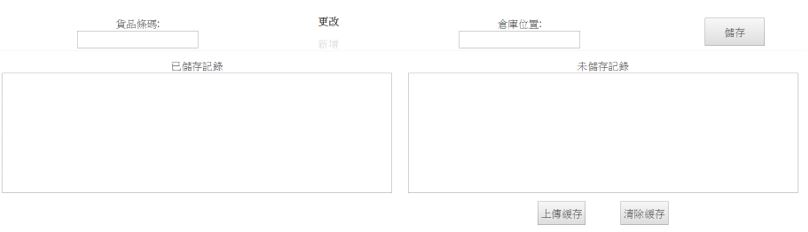

************
Update Product Location Module 
************
Users can Update the Location of different Products in this Module.

|updatepro|

.. list-table:: Update Product Location Module
    :widths: 10 50
    :header-rows: 1
    :stub-columns: 1

    * - FIELD NAME
      - FIELD DESCRIPTION
    * - 貨品條碼
      - The Product Barcode
    * - 倉庫位置
      - The Product New Location
    * - 已儲存記錄
      - The Previous Saved Product Location Record
    * - 未儲存記錄
      - The New Unsaved Product Location Record

