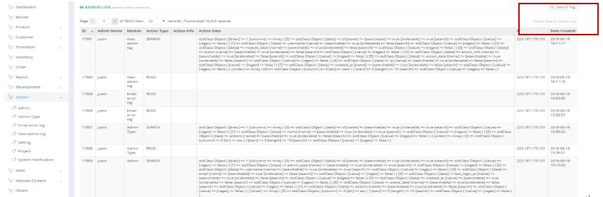
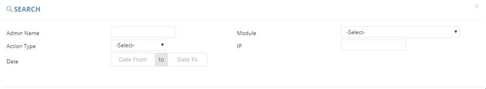

************
View Admin Log Module
************
View Admin Log Module displays the details of Action carried out by different Admins. User can search the Admin Log by clicking on the buttons on top of the Admin Log table and search Admin Log by inputting details into the Input Box.

|viewadmin|

.. list-table:: View Admin Log Module
    :widths: 10 50
    :header-rows: 1
    :stub-columns: 1

    * - FIELD NAME
      - FIELD DESCRIPTIONS
    * - ID
      - The View Admin Log ID
    * - Admin Name
      - The Name of Admin
    * - Module
      - The Module Admin viewed
    * - Action Type
      - The type of Action carried out by The Admin in The Module
    * - Action Info
      - Basic Info about admin action
    * - Action Data
      - The detail data of the Action
    * - IP
      - The location of the Action
    * - Date Created
      - The Time of Action
      
Search
==================
Users can Search Admin Log by clicking on the “Search Tag” on top of the Admin Log Table or input admin name into the input box on top of the Admin Log Table.

|viewadmin_search|

.. list-table:: View Admin Log Module Search
    :widths: 10 50
    :header-rows: 1
    :stub-columns: 1

    * - FIELD NAME
      - FIELD DESCRIPTIONS
    * - Admin Name
      - The Name of Admin
    * - Module
      - The Module Admin involved
    * - Action Type
      - The Type of Action carried out by The Admin
    * - IP
      - The IP Address of Admin
    * - Date
      - The Date of Admin Action
    * - Action Info
      - Basic Info about admin action

