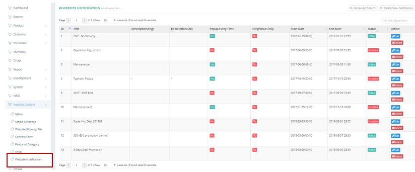
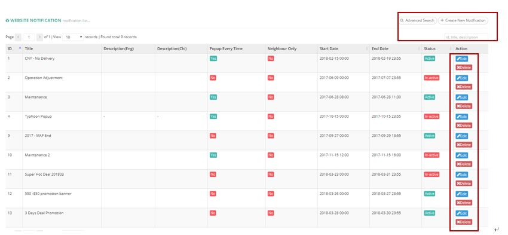
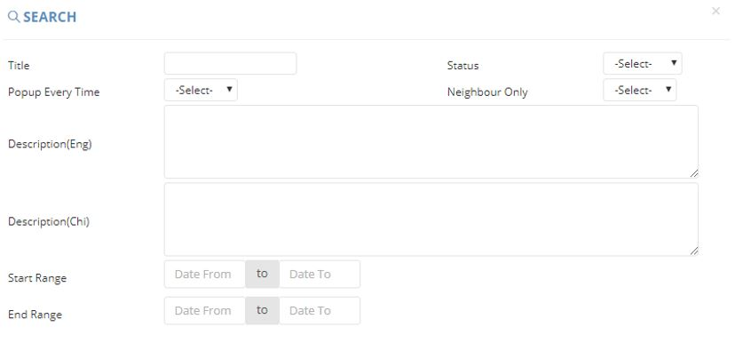
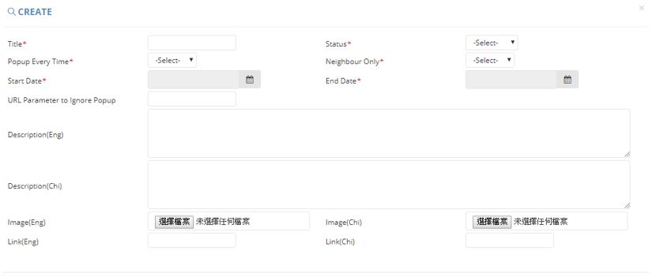

************
Website Notification Module
************
Website Notification Module displays Details of Notifications shown on Ztore.

|webnot|

.. list-table:: Website Notification Module
    :widths: 10 50
    :header-rows: 1
    :stub-columns: 1

    * - FIELD NAME
      - FIELD DESCRIPTIONS
    * - ID
      - The Website Notification ID
    * - Title
      - The Title of Website Notification
    * - Description(Eng)
      - The English Description of Website Notification 
    * - Description(Chi)
      - The Chinese Description of Website Notification
    * - Popup Every Time
      - "Yes" or "No" for the Website Notification to pop up every time
    * - Neighbour Only
      - Is for VIP customer only?;
        If yes, then the notification only will be displayed for VIP
    * - Start Date
      - The Starting Date of releasing the Website Notification
    * - End Date
      - The Last Date of releasing the Website Notification
    * - Status
      - Active/ Inactive Website Notification
    * - Action
      - Edit or Delete Website Notification Item
      
Buttons
==================
User cam Search and Create Website Notifications by clicking on the buttons on top of the Website Notification table. You can also Edit and Delete Existing Website Notification Items by clicking on the corresponding buttons in the “Action” column.

|webnot_buttons|

.. list-table:: Website Notification Module Buttons
    :widths: 10 50
    :header-rows: 1
    :stub-columns: 1

    * - BUTTONS
      - DESCRIPTIONS
    * - Advanced Search
      - User can Search for Website Notification Items by inputting criterion into the popup window
    * - Create New Notification
      - User can create new Website Notification
    * - ID, Title, Description Input Box
      - User can quick search with Website Notification Item Details
    * - Edit
      - Edit Existing Website Notification Item Details
    * - Delete
      - Delete Existing Website Notification Item
      
Advanced Search
==================
User can Search for Website Notification Items by clicking on the “Advanced Search” buttons on top of the Website Notification table and input searching criterion into the popup window.

|webnot_search|

.. list-table:: Website Notification Module Advanced Search
    :widths: 10 50
    :header-rows: 1
    :stub-columns: 1

    * - FIELD NAME
      - FIELD DESCRIPTIONS
    * - Title
      - The Title of The Website Notification    
    * - Status
      - Active/ Inactive Website Notification
    * - Popup Every Time
      - "Yes" or "No" Popup Every time
    * - Neighbour Only
      - Is for VIP customer only?;
        If yes, then the notification only will be displayed for VIP
    * - Description(Eng)
      - The English Description of Website Notification
    * - Description(Chi)
      - The Chinese Description of Website Notification
    * - Start Range
      - The Stating Date Range of Website Notification
    * - End Range
      - The Ending Date Range of Website Notification
      
Create
==================
User can Create New Website Notification Items by clicking on the “Create New Notification” button on top of the Website Notification Table and input Details into the popup window

|webnot_create|

.. list-table:: Create Website Notification
    :widths: 10 50
    :header-rows: 1
    :stub-columns: 1

    * - FIELD NAME
      - FIELD DESCRIPTIONS
    * - ID
      - The System Notification ID
    * - Title
      - The System Notification Title
    * - Notification Type
      - The Type of System Notification
    * - Notification Label
      - The Notification Label of System Notification
    * - Status
      - Active/ Inactive System Notification
    * - Create By
      - The Person who create The System Notification
    * - Update By
      - The Latest Update Person of The System Notification
    * - Create At
      - The Date of creating The System Notification
    * - Update At
      - The Latest Update Date of The System Notification
    * - Content
      - The Content of System Notification

