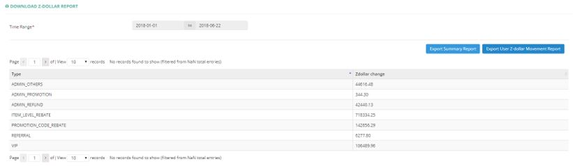
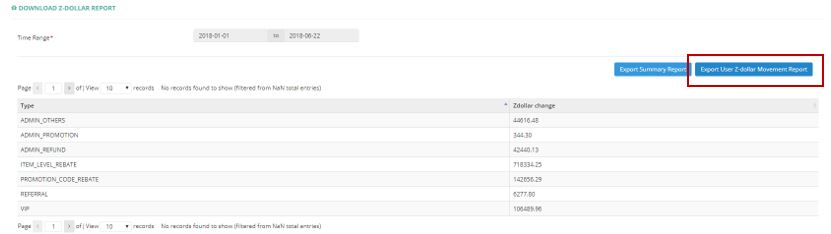

************
Z-Dollar Report Module
************
Z-Dollar Report Module displays different types of Z-Dollar change occurred during a Time Range specified by the User.

|zdollarreport|

.. list-table:: Z-Dollar Report Module
    :widths: 10 50
    :header-rows: 1
    :stub-columns: 1

    * - FIELD NAME
      - FIELD DESCRIPTIONS
    * - Type
      - The Type of Z-Dollar Change
    * - Z-Dollar Change
      - The Amount of Z-Dollar Change
      
User Z-Dollar Movement Report
==================
Users can extract the Z-Dollar Movement Details of different Customers by clicking on the “Export User Z-dollar Movement Report” button.

|zdollarreport1|

.. list-table:: Z-Dollar Movement Report
    :widths: 10 50
    :header-rows: 1
    :stub-columns: 1

    * - FIELD NAME
      - FIELD DESCRIPTIONS
    * - User SN
      - The Customer ID
    * - First Name
      - The Customer First Name 
    * - Last Name
      - The Customer Last Name
    * - Company
      - The Company of Customer working for
    * - Opening Balance
      - The Z-Dollar Opening Balance before the Movement
    * - Earn By ADMIN_OTHERS
      - The Amount of Z-Dollar Movement by “ADMIN_OTHERS” Type of The Customer
    * - Earn By ADMIN_PROMOTION
      - The Amount of Z-Dollar Movement by “ADMIN_PROMOTION” Type of The Customer
    * - Earn By ADMIN_REFUND
      - The Amount of Z-Dollar Movement by “ADMIN_REFUND” Type of The Customer
    * - Earn By ITEM_LEVEL_REBATE
      - The Amount of Z-Dollar Movement by “ITEM_LEVEL_REBATE” Type of The Customer
    * - Earn By ITEM_LEVEL_REBATE
      - The Amount of Z-Dollar Movement by “ITEM_LEVEL_REBATE” Type of The Customer
    * - Earn By PROMOTION_CODE_REBATE
      - The Amount of Z-Dollar Movement by “PROMOTION_CODE_REBATE” Type of The Customer
    * - Earn By REFERRAL
      - The Amount of Z-Dollar Movement by “REFERRAL” Type of The Customer
    * - Earn By VIP
      - The Amount of Z-Dollar Movement by “VIP” Type of The Customer
    * - Earn By ZMILE_DAY
      - The Amount of Z-Dollar Movement by “ZMILE_DAY” Type of The Customer
    * - Total Earned
      - The Total Amount of Z-Dollar Earned by The Customer before the Movement during the period
    * - Z-Dollar Issued
      - The Total Amount of Z-Dollar Movement during the period
    * - Ending Balance
      - The Z-Dollar Ending Balance of The Customer

