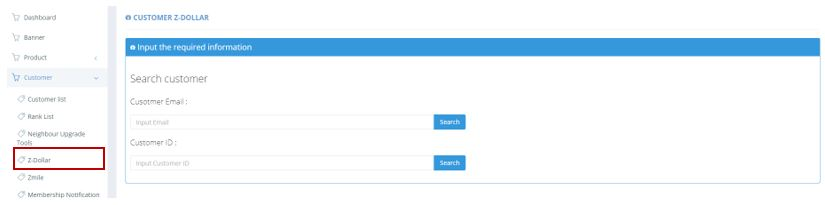
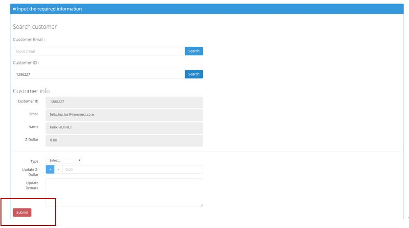

************
Z-Dollar Module 
************
Users can update the Z-Dollar Amount of a Customer by Entering the Customer ID or Customer Email.

|zdollar|

.. list-table:: Z-Dollar Module
    :widths: 10 50
    :header-rows: 1
    :stub-columns: 1

    * - FIELD NAME
      - FIELD DESCRIPTION
    * - Customer Email
      - Input Customer Email here
    * - Customer ID
      - Input Customer ID here
      
After Searching the Customer with Email or ID, Users can click on the “Submit” button to upgrade the Z-Dollar Amount of The Customer.

|zdollar2|

.. list-table:: Upgrade Z-Dollar
    :widths: 10 50
    :header-rows: 1
    :stub-columns: 1

    * - FIELD NAME
      - FIELD DESCRIPTION
    * - Type
      - The Type of Z-Dollar Change
    * - Update Z-Dollar
      - The Amount of Z-Dollar Change
    * - Update Remark
      - The Additional Information of Making the Z-Dollar Change

