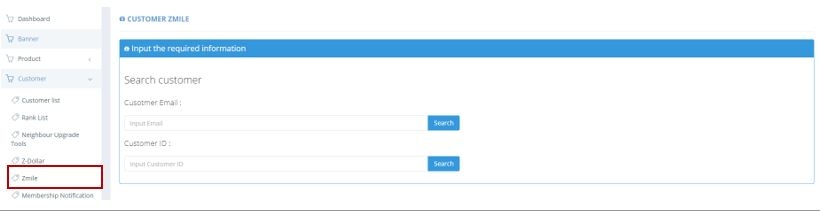
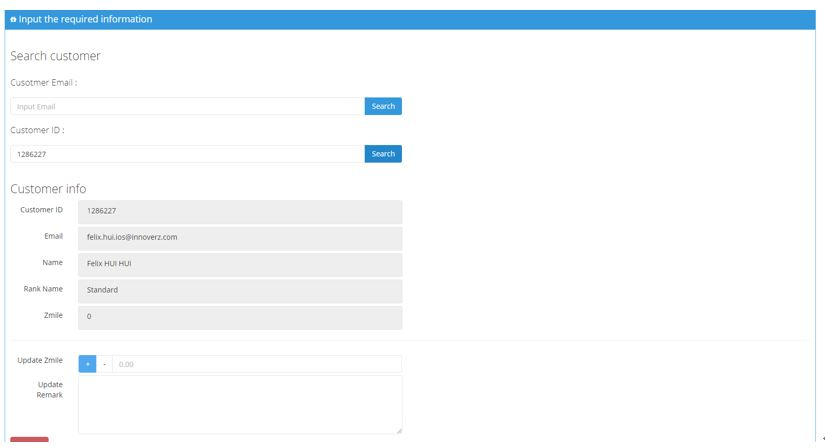

************
Zmile Module 
************
Users can update the Zmile Amount of a Customer by Entering the Customer ID or Customer Email 

|zmile|

.. list-table:: Zmile Module
    :widths: 10 50
    :header-rows: 1
    :stub-columns: 1

    * - FIELD NAME
      - FIELD DESCRIPTION
    * - Customer Email
      - Input Customer Email here
    * - Customer ID
      - Input Customer ID here
      
After Searching the Customer with Email or ID, Users can click on the “Submit” button to upgrade the Zmile Amount of The Customer.

|zmile2|

.. list-table:: Upgrading Zmile
    :widths: 10 50
    :header-rows: 1
    :stub-columns: 1

    * - FIELD NAME
      - FIELD DESCRIPTION
    * - Customer ID
      - The Customer ID
    * - Email
      - The Customer Email
    * - Name
      - The Customer Name
    * - Rank Name
      - The Rank of Customer
    * - Zmile
      - The Amount of Zmile of The Customer

